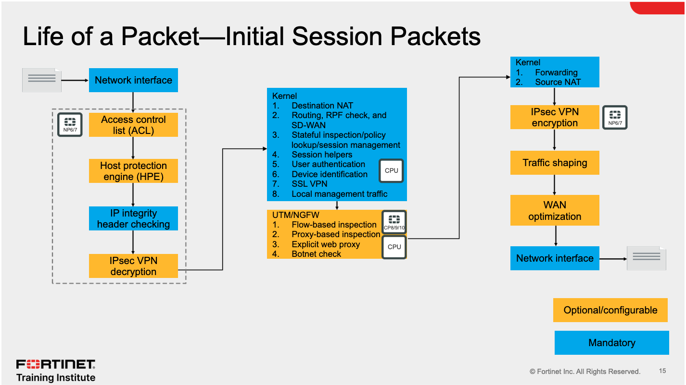
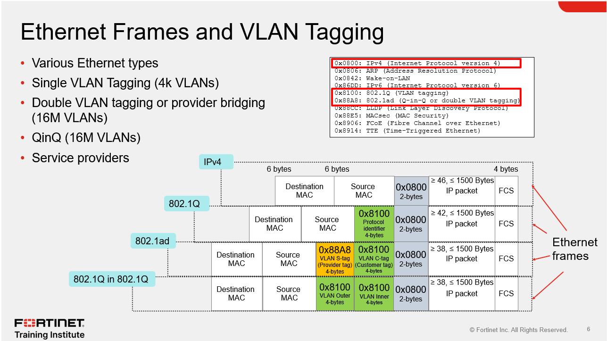
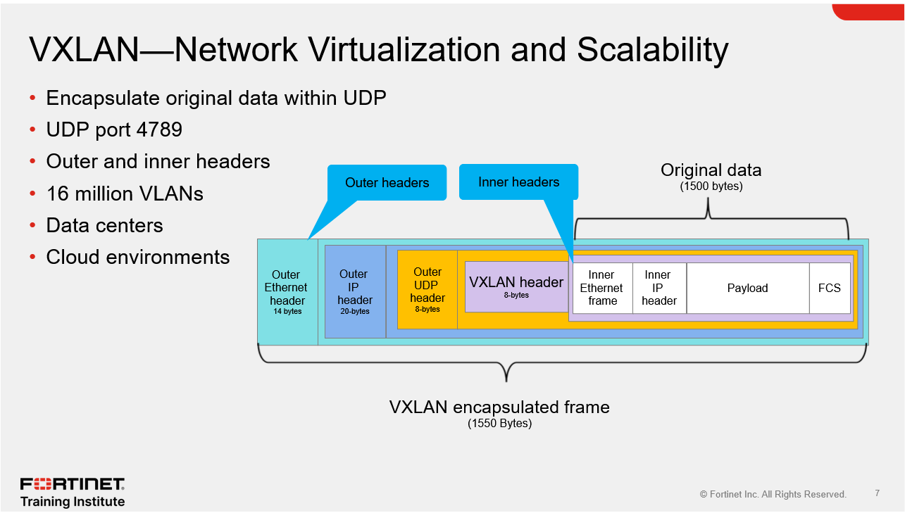

# Life of a Packet: Initial Session Packets



### INGRESS SIDE (Left Column — Incoming Packet Path)
Packets enter from the left and flow **top to bottom** through these mandatory and optional steps:

### 1. **Network Interface (Ingress)**
The packet arrives on a physical or logical interface. This is the entry point into the FortiGate.

### 2. **Access Control List (ACL)**
- This is an **NP7/NP6-offloaded** step (note the chip icon on the left).
- ACLs are checked first to drop obviously bad or unwanted traffic before it consumes CPU resources.
- This is a **hardware-level** check — very fast.

### 3. **Host Protection Engine (HPE)**
- Also handled by the **NP** (Network Processor).
- HPE protects the FortiGate itself from DoS attacks (e.g., rate-limiting SYN floods).
- It prevents the FortiGate's CPU from being overwhelmed by attack traffic.

### 4. **IP Integrity Header Checking**
- Again, NP-offloaded.
- Validates that IP headers are well-formed and not malformed/crafted to exploit vulnerabilities.
- Malformed packets are dropped here.

### 5. **IPsec VPN Decryption** *(Optional/Configurable — shown in dashed box)*
- If the incoming packet is IPsec-encrypted, it is **decrypted here** before further processing.
- The NP can handle this in hardware if the algorithm is supported.
- This is shown as **optional** because it only applies to IPsec VPN traffic.

### MIDDLE PROCESSING (Center — Kernel + UTM/NGFW)
After ingress processing, the packet moves to the center for deep inspection.

### Kernel Processing (Blue box — 8 steps):
This is where the core FortiOS kernel handles the session. Steps in order:

1. **Destination NAT** — If a VIP (Virtual IP) or DNAT policy applies, the destination IP is translated *before* routing.
2. **Routing, RPF check, and SD-WAN** — The FortiGate looks up the routing table. Reverse Path Forwarding (RPF) verifies the source IP is reachable via the expected interface. SD-WAN rules are evaluated here.
3. **Stateful inspection / policy lookup / session management** — The firewall policy table is checked. If a matching policy is found, a **session entry** is created in the session table. This is where ALLOW or DENY is decided.
4. **Session helpers** — For protocols like FTP, SIP, H.323 that embed IP/port info in the payload, session helpers rewrite or track that data.
5. **User authentication** — If the policy requires authentication (captive portal, FSSO, RSSO, etc.), it is checked here.
6. **Device identification** — FortiGate identifies the device type based on DHCP fingerprinting, HTTP User-Agent, and other signals.
7. **SSL VPN** — SSL VPN tunnel traffic is processed/decrypted here.
8. **Local management traffic** — Traffic destined *for* the FortiGate itself (e.g., GUI, SSH, SNMP) is handled here rather than forwarded.

### UTM/NGFW Processing (Yellow box — 4 steps):
This is the **content inspection layer**, handled partly by the **CP (Content Processor)** and partly by the **CPU**:

1. **Flow-based inspection** — The CP chip accelerates pattern matching for IPS, antivirus, and application control in flow mode. Faster but slightly less thorough than proxy-based.
2. **Proxy-based inspection** — Full content buffering and deep inspection (e.g., antivirus in full scan mode, web filtering with certificate inspection). Handled by the CPU — more thorough but slower.
3. **Explicit web proxy** — If FortiGate is configured as an explicit proxy, this handles that traffic path.
4. **Botnet check** — Checks source/destination IPs and domains against Fortinet's botnet database.

### EGRESS SIDE (Right Column — Outgoing Packet Path)
After processing, the packet exits top to bottom:

1. **Kernel: Forwarding + Source NAT** — The packet is forwarded toward its destination. If an outbound NAT policy (SNAT) applies, the source IP is translated here.
2. **IPsec VPN Encryption** *(Optional — NP-offloaded)* — If the outbound traffic needs to be sent over an IPsec tunnel, it is encrypted here.
3. **Traffic Shaping** *(Optional/Configurable)* — QoS and bandwidth shaping policies are applied.
4. **WAN Optimization** *(Optional/Configurable)* — WAN-OPT (if licensed and configured) compresses and deduplicates traffic.
5. **Network Interface (Egress)** — The packet exits via the outbound interface.

### Color Legend
- **Orange/Yellow boxes** = Optional or configurable steps (only happen if the feature is enabled/licensed).
- **Blue boxes** = Mandatory steps — every packet goes through these.

### Processor Icons Explained
- **NP6/NP7 chip icon** = Handled by the Network Processor (hardware offload — no CPU used).
- **CP5/CP9/CP10 icon** = Handled by the Content Processor (hardware-accelerated content inspection).
- **CPU label** = Handled by the main FortiGate CPU (software path — slower, more flexible).

### Supporting Explanations
**On NP (Network Processor):**
The NP handles early-stage security tasks like ACL, HPE, and IP integrity checking. Once a session is fully established and the session key is installed in the NP, **subsequent packets in that session are offloaded** entirely to the NP, bypassing the CPU completely. The NP also handles IPsec encryption/decryption when the configured algorithms are hardware-supported.

**On CP (Content Processor):**
The CP acts as a **co-processor** to the FortiGate CPU. It offloads heavy compute tasks like IPS pattern matching for flow-based UTM, SSL/TLS encryption and decryption for deep SSL inspection, and IPsec operations for supported algorithms. This dramatically improves throughput for security-enabled traffic.

**On Virtual FortiGates (VMs):**
Virtual FortiGates follow **the exact same processing order**, but since there is no physical NP or CP hardware, **the CPU handles all steps**. Nothing is offloaded. This is why VM FortiGates have lower throughput than physical appliances with NP/CP chips.

**Important Facts:**
- **DNAT happens BEFORE routing** — this is a classic exam question. The destination IP must be translated first so the routing table lookup uses the correct (translated) destination.
- **SNAT happens AFTER forwarding** — on the egress side, after the routing decision is made.
- **ACL, HPE, and IP integrity checks are NP-offloaded** — they happen in hardware before the CPU is involved.
- **Session helpers are in the kernel layer**, not UTM — FTP, SIP, etc. are handled before content inspection.
- **Flow-based inspection uses the CP chip; proxy-based uses the CPU.**
- **IPsec decryption is on the ingress side; IPsec encryption is on the egress side.**
- The **first packet** of a session goes through ALL these steps. **Subsequent packets** in an established session can be offloaded to the NP (hardware fast path).
- Virtual FortiGates **cannot offload** to NP or CP — the CPU handles everything.

**Exam Traps:**
- ❌ Don't say routing happens before DNAT — it's the other way around. **DNAT → Routing.**
- ❌ Don't confuse flow-based (CP-accelerated) with proxy-based (CPU-only). They are separate paths.
- ❌ Don't assume IPsec VPN decryption/encryption always uses the NP — it only does if the **algorithm is supported in hardware**.
- ❌ Traffic shaping and WAN optimization are **optional/configurable**, not mandatory steps.
- ❌ Local management traffic (to the FortiGate itself) is handled in the **kernel layer**, not UTM/NGFW.
- ❌ On VMs, **no hardware offload exists at all** — don't apply NP/CP logic to virtual FortiGates.

# Global Database

### • Global-to-local ADOM compatibility
This refers to the **firmware version compatibility rule** between the Global Database and the local ADOMs it manages. The Global ADOM and local ADOMs must be at the **same version OR within two versions** of each other.

- Example: A **Global Database at version 7.6** can manage ADOMs at **7.6, 7.4, and 7.2**.
- It **cannot** manage an ADOM running a version more than 2 major versions behind (e.g., 7.0 or older would not be compatible with a 7.6 Global DB).
- This ensures that global objects and policies remain syntactically and functionally compatible when pushed down.

### • Reserved prefix "g"
All **global objects** created in the Global Database are automatically **prefixed with the letter "g"**. This prefix is **reserved by FortiManager** — administrators are **not allowed** to manually create custom objects using the "g" prefix in any local ADOM. This prevents naming conflicts between global objects and locally created objects.

### Supporting Text Explanations

**"The global database stores common objects and policies for use across multiple ADOMs..."**
The purpose is centralization — instead of managing the same security objects (e.g., Microsoft login addresses, DNS servers, NTP servers) in 10 different ADOMs, you define them once in the Global DB and push them everywhere.

**"The global ADOM and local ADOMs are compatible with ADOMs at the same version and two versions earlier."**
This is the **n-2 compatibility rule**. Global DB at 7.6 supports local ADOMs at 7.6, 7.4, and 7.2. A local ADOM at 7.0 would be **out of support range**.

**"You should ensure that firmware versions match for optimal synchronization."**
While cross-version is supported (up to n-2), identical versions are always preferred to avoid any feature or syntax mismatches in pushed configurations.

**"Global objects and configurations on FortiManager are prefixed with the letter 'g', which is reserved to prevent the creation of custom objects with this prefix."**
The "g" prefix is a **system-reserved namespace**. Admins trying to create an object named "gmyobject" in a local ADOM will be blocked — FortiManager enforces this reservation.

**Important Facts:**
- The **Global Database** is a special ADOM that sits **above all local ADOMs** in the FortiManager hierarchy.
- It stores **shared objects and global policies** that can be applied to **multiple ADOMs simultaneously**.
- The **"g" prefix** is automatically applied to all global objects and is **reserved** — administrators cannot create custom objects with this prefix.
- **Version compatibility rule (n-2):** The Global Database supports local ADOMs at the **same version and up to two versions earlier**. E.g., Global DB 7.6 → supports 7.6, 7.4, 7.2.
- FortiGuard feeds threat intelligence **into the Global Database**, which then distributes to ADOMs below.
- Each local ADOM still maintains its own **Device Layer and Policy Layer** in addition to receiving global policies.

**Exam Traps:**
- ❌ Don't confuse the **Global Database** with the **root ADOM** — they are different. The root ADOM is a local ADOM; the Global Database is a separate, elevated construct above all ADOMs.
- ❌ The "g" prefix is **reserved by the system** — you cannot use it for custom objects. This is a likely trap question.
- ❌ The n-2 rule means **two major versions back**, not two minor versions. 7.6 supports 7.4 and 7.2 — it does **not** support 7.0.
- ❌ Global policies do **not replace** local ADOM policies — they are applied **in addition to** local policies (as header or footer policies around the local policy package).
- ❌ FortiGuard updates go to the **Global Database first**, not directly to each individual ADOM — the Global DB then serves all ADOMs below it.

# Navigating Per-Device Mapping Challenges

### ✅ AVAILABLE Per-Device Mapping Objects
These object types **support** per-device mapping — you can assign different values per FortiGate.

#### ■ Firewall Objects
- **Addresses** — e.g., one address object called "internal_subnet" can map to 192.168.1.0/24 on Site1 and 10.10.1.0/24 on Site2
- **Virtual IPs & Virtual IP Group** — VIPs for NAT/port forwarding can be mapped per device
- **IPv4 Pool and IPv6 Pool** — NAT IP pools can differ per device
- **Virtual Server & IPv6 Virtual Server** — Load balancing virtual servers
- **ZTNA Server & IPv6 ZTNA Server** — Zero Trust Network Access server entries

#### ■ Security Profiles
- **N/A** — No security profiles support per-device mapping

#### ■ User & Authentication
- **User Groups** — Different devices can reference the same group name but map to different local group membership
- **LDAP Servers** — Each site may point to a local LDAP/AD server
- **Radius Servers** — Site-specific RADIUS servers
- **TACACS+** — Site-specific TACACS+ servers

#### ■ Security Fabric
- **FortiNAC** — Per-device FortiNAC integration
- **Fortinet Single Sign-On Agent** — Per-device FSSO agent pointing to local AD

#### ■ Advanced
- **Metadata Variables** — Variables (like $variable) that resolve to different values per device
- **Dynamic Local Certificate** — Per-device certificate mapping
- **Dynamic VPN Tunnel** — Per-device VPN tunnel references

---

### ❌ UNAVAILABLE Per-Device Mapping Objects
These object types **do NOT support** per-device mapping. They are shared as-is across all devices in the ADOM.

#### ■ Firewall Objects (Unavailable)
- Internet Service, Services & Service Group, Schedules, Network Service, IP Pool Group, Shared Traffic Shapers & Per-IP Traffic Shapers
- Shaping Profile, Health Check, Web Proxy Forwarding Server, Authentication Scheme, Security Posture Tag

#### ■ Security Profiles (Unavailable — the largest list)
- **Antivirus** — Same AV profile applies to all devices
- **Web Filter** — Shared web filtering policy
- **Video Filter**
- **DNS Filter**
- **Application Control**
- **Inline CASB** — Cloud Access Security Broker
- **Intrusion Prevention (IPS)**
- **Email Filter**
- **File Filter Profile**
- **VoIP**
- **ICAP**
- **Web Application Firewall**
- **Data Loss Prevention**
- **Virtual Patching**
- Protocol Options, SSL/SSH Inspection, Profile Group, Application Signatures, Application Group, IPS Signatures, Email List, Web Rating Overrides, Web URL Filter, Web Content Filter, Web Filter Local Category, ICAP Servers, File Filter, Video YouTube Channel Filter

#### ■ User & Authentication (Unavailable)
- User Definitions, POP3 User
- PKI User and Groups, SMS Server, FortiTokens

#### ■ Security Fabric (Unavailable)
- Public SDN Connector, Private SDN Connector, Poll Active Directory Server, RADIUS Single Sign-On Agent, pxGrid Connector, ClearPass Connector, NSX-T Connector, FortiFlex Connector, vCenter Connector, Symantec Endpoint Protection, Exchange Server Connector, JSON API Connector, Threat Feeds

#### ■ Advanced (Unavailable)
- **Replacement Message Group** — Shared across all devices

### Supporting Text Explanations

**"Why is it important to recognize object configurations that are eligible for per-device mapping?"**
If you **import a configuration from the device layer** that the policy layer doesn't support (i.e., it's an unavailable object type), it creates a **conflict**. FortiManager then has to choose between the FortiGate's own value and the FortiManager policy layer value — this causes inconsistency and unpredictable behavior.

**"It's beneficial to memorize or identify objects eligible for per-device mapping so that you don't import objects with duplicate names into the FortiManager policy layer database."**
If the same object name exists in both the device layer AND the policy layer, and the object type doesn't support per-device mapping, you end up with a **duplicate name conflict**. FortiManager cannot resolve which value to use cleanly.

**"If a conflict occurs, the solution is to create a uniquely named object on FortiGate and import it again to the policy."**
The recommended fix when a conflict arises is:
1. Go to the FortiGate directly
2. Rename the conflicting object to something unique
3. Re-import it into the FortiManager policy layer

This avoids the naming collision entirely.

**Important Facts:**
- **Per-device mapping** allows one shared policy-layer object to have **different values on different FortiGates** within the same ADOM.
- **Addresses, VIPs, IP Pools, ZTNA Servers, LDAP/RADIUS/TACACS+ servers, FSSO agents, Metadata Variables** → all **support** per-device mapping.
- **Security Profiles (Antivirus, IPS, Web Filter, App Control, etc.)** → **do NOT support** per-device mapping — they are always shared as-is.
- **Security Fabric connectors** (SDN, ClearPass, NSX-T, etc.) → **do NOT support** per-device mapping.
- **User Definitions** are unavailable, but **User Groups** ARE available for per-device mapping.
- If an unsupported object type is imported with a duplicate name, it causes a **conflict** in FortiManager.
- The resolution to a conflict is: **rename the object on FortiGate → re-import into policy layer**.

**Exam Traps:**
- ❌ Security Profiles **cannot** be per-device mapped — this is a very common trap. Many candidates assume AV or IPS profiles can vary per device through mapping, but they cannot.
- ❌ **User Definitions** are unavailable, but **User Groups** ARE available — don't confuse the two.
- ❌ **FortiNAC and FSSO Agent** ARE available for per-device mapping (Security Fabric section, left column) — but most other Security Fabric connectors are NOT.
- ❌ A conflict does NOT mean the object is automatically deleted or overwritten — FortiManager forces a **choice** between the device value and the policy layer value, which causes inconsistency.
- ❌ The fix for a conflict is **not** to delete the object in FortiManager — it is to **rename it on the FortiGate** and re-import.
- ❌ **Metadata Variables** (under Advanced) are specifically designed to hold per-device values — they are the cleanest way to handle device-specific data in shared templates and policies.

# Use Case 1 — Running Remote Scripts for CA Certificates

## 📌 Three Bullet Points Explained

### • Remote FortiGate Directly (via CLI)
This is the **script run location** selected for this use case. When you choose this option, FortiManager acts as a proxy and pushes the CLI commands directly to the managed FortiGate — the commands execute on the device in real time. The FortiManager database is **not** modified first; the change goes straight to the FortiGate.

This is the correct choice when you want to:
- Push certificates (which live in the device layer, not the policy layer)
- Make device-level changes that don't need to go through the install workflow
- Apply changes that are not easily modeled in FortiManager's object database

### • FortiManager retrieves database update
After the remote script executes successfully on the FortiGate, FortiManager automatically **retrieves** the updated configuration from the FortiGate. This pulls the new certificate (and any other changes made by the script) back into the **FortiManager device database**, keeping both in sync.

This retrieval is visible in the **Configuration Revision History** — a new revision entry is created showing who ran it and when.

### • Device database synchronized
After the retrieval completes, the **Config Status** of the managed FortiGate in FortiManager changes to **✓ Synchronized**. This confirms that the FortiManager device database now matches what is actually running on the FortiGate.

## Create New Script Dialog

**Navigation path:** `Device Manager > Scripts > Create new`

The **Create New Script** dialog is open with these fields:

| Field | Value |
|---|---|
| **Script Name** | CA Certificate |
| **Comments** | *(blank)* |
| **Type** | CLI Script |
| **Run script on** | **Remote FortiGate Directly (via CLI)** ← highlighted in blue |
| **Validate on change** | ☑ (checked) |
| **Validation device platform** | FortiGate-VM64 |
| **Script details** | CLI commands (partially visible) |

**Key field — "Run script on: Remote FortiGate Directly (via CLI)":**
This is the critical setting for this use case. The dropdown options for "Run script on" are:
- **Remote FortiGate Directly (via CLI)** ← selected here
- Device Database
- Policy Package/ADOM Database

By selecting "Remote FortiGate Directly", the script executes live on the device, not in FortiManager's local database first.

**Script details (partially visible CLI commands):**
```
config vpn certificate ca
  edit "CA Name"
    set ca <certificate_data>
  end
```
These commands navigate into the CA certificate configuration tree on the FortiGate and create/import the CA certificate entry. The actual certificate content (base64 PEM data) would be embedded in the script.

**"Validate on change" checkbox is ticked:**
This tells FortiManager to validate the script syntax against the specified device platform (FortiGate-VM64) before running it — a safety check to catch CLI errors before pushing to live devices.

## Configuration Revision History

**Navigation path:** `Device Manager > Device & Groups > Managed FortiGate > FortiGate > Dashboard: Summary > Configuration and Installation > Revision > Total Revision`

The **Configuration Revision History** table is shown with columns:
- **ID**, **Date & Time**, **Name**, **Created by**, **Installation**

**Visible revision entry:**
| ID | Date & Time | Name | Created by | Installation |
|---|---|---|---|---|
| ✓ 3 | 2025-01-28 12:27:01 | *(name)* | **script_manager** | **Retrieved** |

**Key observations:**
- **Created by: script_manager** — This tells you the revision was created automatically by FortiManager's script engine, not by a human admin manually retrieving the config. This is the automated retrieval that happens after a remote script runs.
- **Installation: Retrieved** — This confirms the revision was created via a **retrieve** operation (FortiManager pulling config from FortiGate), not via an install (FortiManager pushing config to FortiGate). This is exactly what happens after a Remote FortiGate Directly script executes — FortiManager retrieves to sync.
- **ID: 3** with a ✓ checkmark — indicates this is the current/latest confirmed revision.

## Managed FortiGate Config Status

**Navigation path:** `Device Manager > Device & Groups > Managed FortiGate`

| Device Name | Config Status |
|---|---|
| ✦ HQ-NGFW-1 | **✓ Synchronized** |

**What this means:** After the remote script ran and FortiManager retrieved the updated config, the Config Status is now **Synchronized** — the FortiManager device database matches the live FortiGate configuration exactly. No install is needed.

## Ethernet Frames and VLAN Tagging

### EtherType Reference Table
| EtherType | Protocol |
|---|---|
| 0x0800 | IPv4 |
| 0x0806 | ARP |
| 0x0842 | Wake-on-LAN |
| 0x86DD | IPv6 |
| **0x8100** | **802.1Q (VLAN tagging)** |
| **0x88A8** | **802.1ad (Q-in-Q / Provider Bridging)** |
| 0x88CC | LLDP |
| 0x88E5 | MACsec |
| 0x8906 | FCoE |
| 0x8914 | TTE |

### Four Frame Formats Explained

**1. Standard IPv4 Frame (no VLAN)**
`Dest MAC | Source MAC | 0x0800 | IP Packet | FCS`
Plain Ethernet. No VLAN awareness. Payload ≥ 46, ≤ 1500 bytes.

**2. 802.1Q (Single VLAN Tag)**
`Dest MAC | Source MAC | 0x8100 (4 bytes) | 0x0800 | IP Packet | FCS`
- Inserts a 4-byte 802.1Q tag with EtherType 0x8100 between Source MAC and the IP payload
- Supports up to **4,094 VLANs** (12-bit VLAN ID field)
- Frame is now ≥ 42, ≤ 1500 bytes after the tag

**3. 802.1ad (Double VLAN Tag — S-tag + C-tag)**
`Dest MAC | Source MAC | 0x88A8 S-tag (4 bytes) | 0x8100 C-tag (4 bytes) | 0x0800 | IP Packet | FCS`
- Two tags: outer S-tag (Provider/Service tag, EtherType 0x88A8) + inner C-tag (Customer tag, EtherType 0x8100)
- 4,094 S-VLANs × 4,094 C-VLANs = **~16 million combinations**
- Used by **service providers** to segregate multiple customer VLANs over the same infrastructure

**4. 802.1Q-in-802.1Q (QinQ)**
`Dest MAC | Source MAC | 0x8100 Outer (4 bytes) | 0x8100 Inner (4 bytes) | 0x0800 | IP Packet | FCS`
- Both tags use EtherType 0x8100 (unlike 802.1ad which uses 0x88A8 for the outer)
- Also supports up to **16 million VLAN combinations**
- Common in large enterprise networks and service provider environments

## VXLAN: Network Virtualization and Scalability

**VXLAN (Virtual Extensible LAN)** is fundamentally different from 802.1Q/802.1ad VLAN tagging. Instead of inserting a tag into the Ethernet frame, VXLAN **encapsulates the entire original Ethernet frame inside a UDP packet**.

- **UDP Port:** 4789 (default)
- **VNI (VXLAN Network Identifier):** 24-bit field → supports **16 million virtual networks**
- **Use Cases:** Data centers, cloud environments, anywhere 4,094 VLAN limit is insufficient

### Diagram Explanation — VXLAN Encapsulated Frame (1550 bytes total)


The encapsulated frame has two sections: **Outer headers** and **Inner headers (original data)**:

| Component | Size | Purpose |
|---|---|---|
| Outer Ethernet header | 14 bytes | Gets the packet to the VTEP (tunnel endpoint) |
| Outer IP header | 20 bytes | IP source/dest of the tunnel endpoints |
| Outer UDP header | 8 bytes | UDP port 4789 |
| VXLAN header | 8 bytes | Contains the 24-bit VNI |
| Inner Ethernet frame | original | The original Ethernet frame |
| Payload | up to 1500 bytes | Original data |
| FCS | 4 bytes | Frame Check Sequence |

The original Ethernet frame (1500 bytes) becomes a 1550-byte VXLAN frame, meaning the physical network MTU needs to be 1550+ to avoid fragmentation.

### Why VXLAN vs. 802.1Q?
| Feature | 802.1Q | VXLAN |
|---|---|---|
| VLAN limit | 4,094 | 16 million |
| Transport | Layer 2 | UDP/IP (Layer 3) |
| Use case | Enterprise LAN | Data center / cloud |

## VLANs on FortiGate Interfaces

### Critical Point
You can configure the **same VLAN ID** on different interfaces with different names — and they will be **completely separate broadcast domains**. The VLAN ID alone does not make two VLANs the same; the parent interface also matters.

## Use Case 1: Diverse Connectivity with LACPs (Aggregate Interfaces)

**802.3ad ≠ 802.1ad** — These are completely different standards:
- **802.3ad** = Link Aggregation Control Protocol (LACP) — bonds multiple physical ports for **bandwidth and redundancy**
- **802.1ad** = Double VLAN tagging (provider bridging)

### LACP / Aggregate Interface
- Bundles 2, 4, or 8 physical ports into one logical interface
- Traffic is distributed across all member ports → increased bandwidth
- If one port fails, traffic continues on remaining ports → redundancy

## Use Case 2: FortiSwitch Devices (FortiLink)

**FortiLink** is the dedicated management and data protocol between FortiGate and FortiSwitch. It uses **802.3ad (LACP)** as the underlying connection type.

**MCLAG (Multi-Chassis Link Aggregation)** — Connects two FortiSwitch devices to FortiGate as if they were one unit. This enhances **Layer 2 redundancy**; if one FortiSwitch fails, the other continues forwarding.

## Use Case 3: Hardware Switch

```
config system virtual-switch        ← Enter the virtual-switch configuration
  edit "Hardware Switch"            ← Create/edit a virtual switch named "Hardware Switch"
  set physical-switch "sw0"         ← Bind it to the physical switch chip (sw0)
  config port                       ← Enter port configuration sub-mode
    edit port1                      ← Add port1 as a member
    next
    edit port2                      ← Add port2 as a member
    next
    edit port3                      ← Add port3 as a member
    next
  end
end
```
```
config system interface             ← Enter interface configuration
  edit "Hardware Switch"            ← Reference the hardware switch interface
  set vdom "root"                   ← Assign to root VDOM
  set ip 10.10.10.254 255.255.255.0 ← Set the gateway IP for attached devices
  set allowaccess ping https        ← Allow ping and HTTPS management access
  next
end
```
## Use Case 4: Software Switch

A **software switch** is similar to a hardware switch — multiple ports (and SSIDs) share the same broadcast domain. Key differences:

- Uses the **CPU** for packet processing (not hardware ASIC)
- Supports **wireless SSID interfaces** as members (hardware switch does not)
- Available on **all FortiGate models** (not model-specific)
- **Intraswitch traffic can be disabled** (hardware switch cannot disable it)

### Intraswitch Policy
- `intra-switch-policy implicit` → intraswitch traffic is **allowed** (default behavior)
- `intra-switch-policy explicit` → intraswitch traffic is **blocked**; firewall policies must explicitly permit traffic between member interfaces
```
config system switch-interface       ← Enter software switch config (different command vs. hardware!)
  edit "Software Switch"             ← Create/edit named software switch
  set vdom "root"                    ← Assign to root VDOM
  set member "port1" "SSID" "port3"  ← Add members (interfaces AND SSIDs together — key advantage)
  set intra-switch-policy <implicit or explicit>  ← Control intraswitch traffic behavior
  next
end
```
```
config system interface
  edit "Software Switch"
  set vdom "root"
  set ip 10.10.10.254 255.255.255.0
  set allowaccess ping https
  next
end
```
## Hardware vs. Software Switches (Comparison Table)

This is the most exam-critical slide in the section. The table compares the two switch types across 5 features:

| Feature | Hardware Switch | Software Switch |
|---|---|---|
| **CLI configuration command** | `config system virtual-switch` (with sub-config port) | `config system switch-interface` (members at same level) |
| **Intraswitch traffic** | ✅ Yes (always on) | ✅ Yes (but can be blocked with explicit policy) |
| **Wireless SSIDs** | ❌ No | ✅ Yes |
| **STP (Spanning Tree Protocol)** | ✅ Yes | ❌ No |
| **Supported models** | Specific models only | All models |
| **Processing** | Offloaded to hardware ASIC | Processed in software by CPU |

### Key Takeaways from the Notes
- Hardware switch uses a **sub-configuration** (`config port`); software switch adds members **at the same level** (`set member`)
- Software switch CPU processing can **impact performance** in resource-intensive deployments
- Hardware/VLAN switches support **STP**; software switches do not
- Only use switch options (hardware or software) if acquiring dedicated FortiSwitch/FortiAP devices is not feasible

## Important Facts

1. **VLAN Protocol Options in FortiGate GUI**: 802.1Q (EtherType 0x8100) and 802.1AD (EtherType 0x88A8 outer tag). Only these two appear in the GUI.
2. **FortiGate does NOT add VLAN tags on ingress** — the upstream switch does. FortiGate removes ingress tags and adds egress tags as part of routing.
3. **802.1Q = 4,094 VLANs** (12-bit VLAN ID). **802.1ad and QinQ = ~16 million** combinations.
4. **VXLAN uses UDP port 4789** and a **24-bit VNI** supporting 16 million virtual networks.
5. **VXLAN encapsulates the full original Ethernet frame** inside outer Ethernet/IP/UDP headers — it is not just a tag insertion.
6. **Same VLAN ID on different interfaces = different broadcast domains.** They are independent.
7. **Hardware switch CLI**: `config system virtual-switch` → ports are sub-configured with `config port`
8. **Software switch CLI**: `config system switch-interface` → members are set inline with `set member`
9. **Software switches support wireless SSIDs** as members; hardware switches do not.
10. **Hardware switches support STP**; software switches do not.
11. **Hardware switch processing is offloaded to ASIC**; software switch uses the CPU.
12. **MCLAG** with FortiSwitch = two FortiSwitch units acting as one for Layer 2 redundancy.
13. **FortiSwitch VLANs are best managed via WiFi & Switch Controller > FortiSwitch VLANs** — they then appear automatically under Network > Interfaces.
14. **LACP (802.3ad) recommended port counts**: 2, 4, or 8 physical ports per aggregate.

## ⚠️ Exam Traps

1. **802.1ad ≠ 802.3ad** — These are completely different! 802.1ad = provider bridging (double VLAN tags). 802.3ad = LACP link aggregation. Exam questions may deliberately mix these.

2. **QinQ vs. 802.1ad**: Both support 16M VLANs, but the outer tag EtherType differs — 802.1ad uses **0x88A8** for the outer S-tag; QinQ uses **0x8100** for both outer and inner tags. Don't confuse them.

3. **VXLAN is NOT a VLAN tagging standard** — it is a full UDP encapsulation tunnel protocol. The original frame is completely encapsulated, not just tagged.

4. **Hardware switch is model-specific** — you cannot assume it's available on all FortiGate units. Software switch is available on ALL models.

5. **Intraswitch traffic default**: Both hardware and software switches allow intraswitch traffic by default. The key difference is that **only software switches can disable it** using `intra-switch-policy explicit`.

6. **Software switch with explicit policy**: When you set `intra-switch-policy explicit`, you **must create firewall policies** to allow traffic between member ports — it does not flow automatically.

7. **FortiGate GUI VLAN sub-interfaces**: The VLAN ID column is not shown by default — you must add it via column customization. Don't be tripped up by screenshot questions where it's missing.

8. **VXLAN MTU trap**: VXLAN adds 50 bytes of overhead to the original 1500-byte frame, making the total 1550 bytes. The physical network MTU must accommodate this, or fragmentation occurs.

9. **FortiSwitch VLAN creation path**: The recommended path is **WiFi & Switch Controller > FortiSwitch VLANs**, NOT directly under Network > Interfaces. VLANs created there appear in both places.

10. **802.1Q tag size is 4 bytes** — knowing the exact byte sizes of each header element (Ethernet 14B, IP 20B, UDP 8B, VXLAN 8B) is testable in VXLAN questions.

# VDOM Type 3: LAN Extension VDOM
What it is: A LAN Extension VDOM extends a remote LAN segment back to a central FortiGate using a combination of VPN IPsec tunnels and VXLAN encapsulation. It effectively stretches a Layer 2 broadcast domain across a WAN or internet connection.

Use case: Remote sites or branch offices that need to appear as if they are directly connected to the corporate LAN — same subnet, same broadcast domain — without being physically on-site. The remote device (FortiGate at branch) connects back to the central FortiGate acting as a LAN Extension hub.

Technologies used:
 - IPsec VPN — encrypts the tunnel
 - VXLAN — carries the Layer 2 frames over the IPsec tunnel, enabling broadcast domain extension

### Summary of All Three VDOM Types

| VDOM Type | CLI keyword | Purpose | Layer | Notes |
|---|---|---|---|---|
| **Admin** | `vdom-type admin` | FortiGate management only | N/A | No user traffic at all |
| **Traffic (NAT)** | `vdom-type traffic` + `opmode nat` | User traffic, routing, NAT | Layer 3 | Most common type |
| **Traffic (Transparent)** | `vdom-type traffic` + `opmode transparent` | Security inspection, no routing | Layer 2 | Requires `set manageip` |
| **LAN Extension** | `vdom-type lan-extension` | Extend LAN over IPsec+VXLAN | Layer 2 over WAN | Remote branch use case |

## Important Facts

1. **Three VDOM types exist:** Admin, Traffic, and LAN Extension. Know all three.
2. **Admin VDOM handles zero user traffic** — it is solely for managing the FortiGate device itself.
3. **Traffic VDOM has two operating modes:** NAT (Layer 3) and Transparent (Layer 2). NAT is the default and most common.
4. **Transparent mode requires a management IP** (`set manageip`) because there are no routed interface IPs for administration.
5. **NAT mode is Layer 3; Transparent mode is Layer 2.** Transparent mode has no routing or NAT capability.
6. **LAN Extension VDOM uses both IPsec and VXLAN** together — IPsec for encryption, VXLAN for Layer 2 frame transport.
7. **GUI path for all VDOM creation:** System > VDOM > Create new. The Type tab determines which type.
8. **NAT vs Transparent mode cannot be set from the GUI alone** — you must use CLI `config system settings` → `set opmode nat/transparent` to change the mode of a Traffic VDOM.
9. **NGFW mode (Profile-based vs Policy-based) and Central SNAT** only appear in the GUI when the Traffic type is selected — not for Admin VDOMs.
10. The **LAN Extension VDOM CLI keyword** is `lan-extension` (hyphenated) — `set vdom-type lan-extension`.

---

## Exam Traps

1. **"Traffic VDOM" does not mean NAT mode by default in the exam context** — you must know both NAT and Transparent are sub-options of Traffic VDOMs. Don't assume Traffic = NAT only.

2. **Transparent mode is still a Traffic VDOM** — it is NOT a separate VDOM type. The type is `traffic`; the opmode is `transparent`. A common trap is thinking Transparent mode is its own type.

3. **Admin VDOM ≠ management access to root VDOM** — an Admin VDOM is a specifically typed VDOM. It does not simply mean "the VDOM where the admin logs in." Don't confuse Admin VDOM type with administrator management rights.

4. **`set manageip` is only needed in Transparent mode** — if an exam question asks what is required when configuring a transparent VDOM, the management IP is essential. In NAT mode, each interface has its own IP, so no `manageip` is needed.

5. **LAN Extension ≠ just VPN** — it specifically uses VXLAN over IPsec to extend a Layer 2 segment. A question describing "Layer 2 extension across WAN using VPN and VXLAN" is describing the LAN Extension VDOM, not a plain traffic VDOM with a VPN policy.

6. **You cannot select NAT vs Transparent from the GUI** when creating a new VDOM — the GUI only lets you pick Traffic/Admin/LAN Extension. Switching between NAT and Transparent modes requires **CLI only** (`set opmode`). This is a classic exam trick.

7. **NGFW mode and Central SNAT fields** appear in the Traffic VDOM creation panel — don't be confused if an exam question asks which VDOM type shows these options. The answer is Traffic, not Admin or LAN Extension.

# HA Requirments
### Licensing 
All members must have the same license level across all license types:

FortiGuard subscription licenses (AV, IPS, Web Filtering, etc.)
- VDOM licenses
- FortiClient licenses
- And any other add-on licenses

> Critical Rule: If licensing levels differ between members, the cluster does not fail to form — instead, it degrades to the lowest common license level across all members.

If you buy FortiGuard Web Filtering for only one member of a two-member cluster, neither member will have Web Filtering once they form the cluster. The higher license is effectively wasted until all members match.