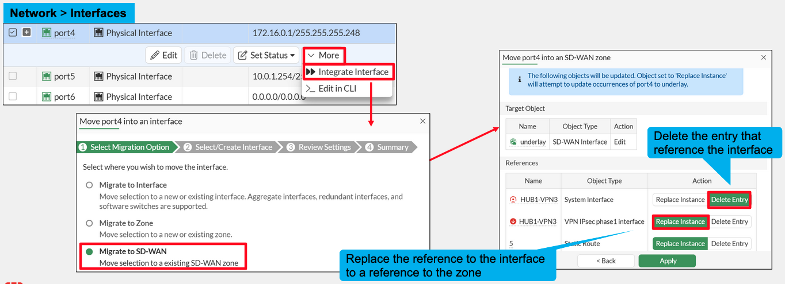
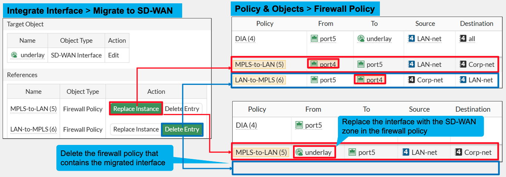
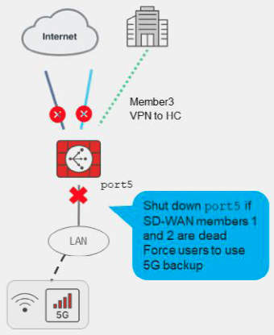
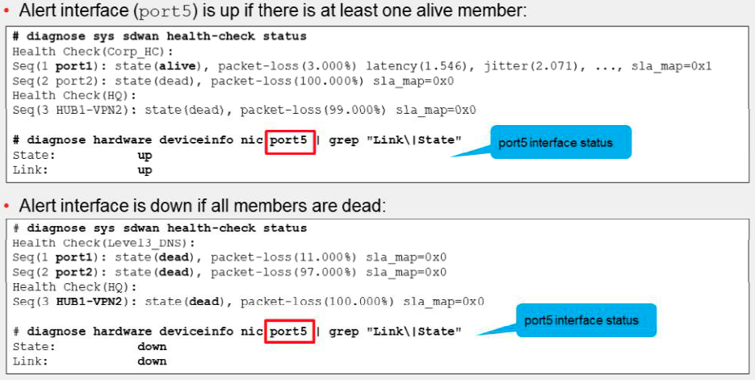

+ SD-WAN is Session based
+ point of presence (PoP): It’s a **gateway** that brings internet or cloud services **closer to users** for faster and more reliable connections.
+ **Cloud on-ramp** means a **dedicated, high-performance connection** between your company’s network and a **cloud provider** (like AWS, Azure, or Google Cloud).
+ Visibility of application detection criteria is, by default, hidden on the FortiGate GUI. Because it is an advanced parameter that requires the administrator to understand its specifics, you must enable the feature visibility on the CLI using the global command `set gui-app-detection-sdwan enable`. Note that if GUI visibility is disabled, configuration for application criteria remains active and configuration is still visible on the CLI.
+ Migrating Interfaces to SD-WAN
	+ 
	+ 
	+ Delete Entry: Delete the Firewall Policy
+ When `update-static-route` is enabled, FortiGate disables the static routes for inactive interfaces. 
+ When you enable `update-static-route`, you must carefully consider the consequence on overlay tunnels.
# **Update-Cascade-Interface Feature (SD-WAN 7.6)**
#### **Overview**

- The **`update-cascade-interface`** feature is **enabled by default** but only functions when at least one **cascade interface** is defined.
- Used to manage interface behavior based on SD-WAN member status.
#### **Behavior**
- **If all SD-WAN members are dead:** FortiGate **shuts down alert interfaces** (e.g., due to degraded performance).
   - **If at least one member is alive:** FortiGate **brings up alert interfaces**.
    #### **Purpose**
- Ensures traffic behind alert interfaces is **rerouted through another device** if FortiGate **cannot forward WAN traffic**.
#### **Configuration Scope**
- Cascade interfaces are **defined globally** for the SD-WAN instance.
- Detection and actions are **activated per performance SLA** (e.g., for underlay links only).
#### **Best Practices**
- Focus on **critical interfaces** (e.g., LAN interfaces providing WAN access).
- Shutting down such interfaces can **trigger failover** via mechanisms like **VRRP**.
#### **Example**
- A company uses a **5G backup device** (not connected to FortiGate).
- A performance SLA monitors **ISP links (port1 and port2)**,  
    with **`update-cascade-interface`** enabled to **shut down port5** when links fail.
    
    