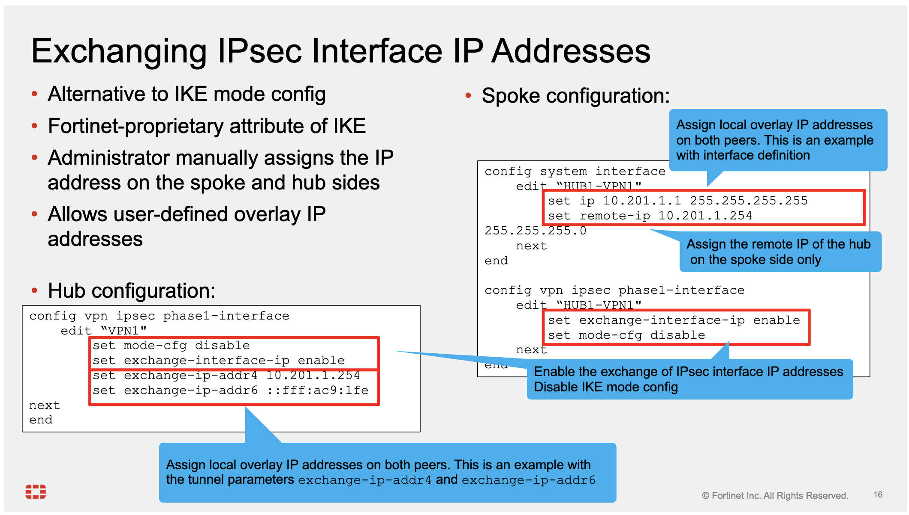
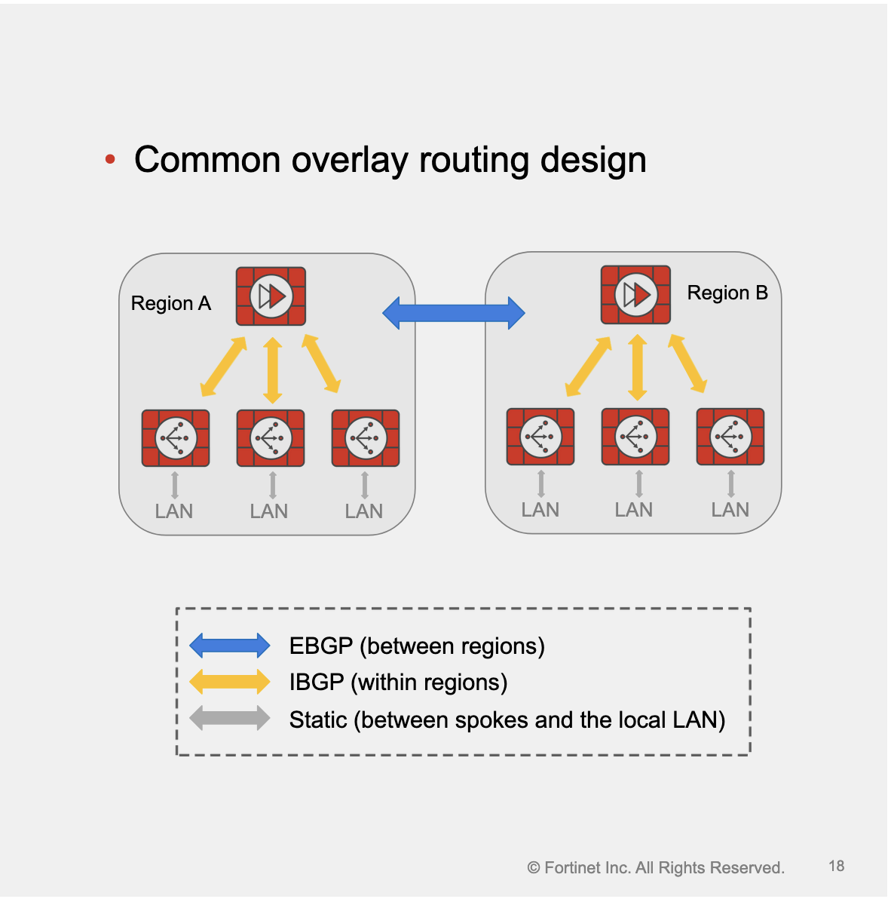

# SD-WAN Overlay Design

## Overlay Tunnel Design in Fortinet SD-WAN

#### Recommended Tunnel Type
- Fortinet SD-WAN supports IPsec, GRE, and IP-in-IP tunnels.
- **IPsec** is the most commonly used and officially recommended protocol for SD-WAN overlay tunnels.
#### Static vs. Dynamic IPsec Tunnels
- **Static tunnels**:
  - Commonly used for full-mesh topologies.
  - Provide stability.
  - Require manual configuration on both ends for each new tunnel.
  - Rarely used in SD-WAN due to poor scalability.
- **Dynamic IPsec tunnels**:
  - Recommended for hub-and-spoke topologies.
  - Highly scalable — spoke configuration remains unchanged when adding new spokes.
#### Tunnel Interface IP Address Configuration Options
- Two available methods:
  - IKE standard **mode-cfg**
	  - Administrator defines a range of IP addresses on the hub
	  - Spoke receives the tunnel interface IP address from the hub
  - Fortinet proprietary **exchange-interface-ip** attribute
	  - Administrator manually assigns the IP address on the spoke and hub sides
---

## IPsec Dynamic Tunnel Establishment (Dial-Up VPN)
- Enables branches to establish IPsec tunnels with a central server without pre-configuring every remote endpoint.
- Common in **hub-and-spoke topologies**.
#### Key Components
- **Dial-up Server**: Hub FortiGate that accepts dynamic connections and assigns virtual IP addresses to clients.
- **Dial-up Client**: Branch FortiGate that initiates the tunnel and receives an assigned IP.
#### IKE Mode Config (Mode-Cfg)
- IKE standard method for dynamically assigning virtual IP addresses to dial-up clients.
**Server-side activation (CLI)**:
**IP assignment sources on server**:
- IP address range
- Named firewall address group
- DHCP server
- RADIUS server
```bash
config vpn ipsec phasel-interface
edit HUB1-VPN1
set type dynamic
set mode-cfg enable
set ipv4-start-ip 192.168.1.65
set ipv4-end-ip 192.168.1.124
set ipv4-netmask 255.255.255.192
end
end
```
**Client-side configuration (CLI)**:
- Default tunnel type: static (dial-up)
- Accept assigned IP on IPsec interface:
```set assign-ip enable```
- Enable mode-cfg:
```set mode-cfg enable```
```bash
config vpn ipsec phasel-interface
edit HUB1-VPN1
set type static
set mode-cfg enable 
set assign-ip enable # Accept the IP address assigned by the server
end
end
```
#### SD-WAN Overlay Orchestrator Behavior
- Automatically configures hubs as dial-up servers.
- Assigns IPs to clients from the administrator-defined range.
- Configures branches as dial-up clients.
---

## IKE Mode Config vs. IPsec Exchange Interface

- **IKE Mode Config** (default in examples):
  - Simple configuration
  - Automatically assigns spoke overlay IP addresses during tunnel negotiation
  - Drawback: Cannot assign fixed (static) IP addresses to spokes; addresses depend on pool availability

- **IPsec Exchange Interface Feature** (alternative):
  - Allows manual assignment of fixed IP addresses on both hub and spoke overlays
  - During IKE negotiation, gateways exchange these pre-configured addresses
  - Enables predictable, static overlay IPs useful for monitoring and identification
  - Addresses can be configured at:
    - Interface level (example uses this on spoke)
    - VPN tunnel parameter level (example uses this on hub)
  - Supports IPv4, IPv6, or both
### 🎁 Key Recommendations and Notes

- With BGP on loopback design: Fortinet recommends setting the tunnel (loopback) IP address in the VPN tunnel definition
- Configuration changes (hub and spoke):
  - Same commands on both sides except:
    - Assign different local overlay IPs
    - On spoke only: explicitly define the hub’s overlay IP address, using the full overlay subnet mask (e.g., /24, not /32) for proper next-hop resolution with IBGP route reflection
### ⚠️ Important Limitation

- Uses a Fortinet-proprietary IKE attribute to exchange addresses
- Works only when both endpoints are FortiGate devices (unlike standard IKE mode config)
---
## Net-Device Parameter in IPsec Phase1-Interface

- **Purpose**: FortiGate-specific parameter that controls whether a kernel interface is created for each dial-up IPsec tunnel.
#### Behavior When Enabled
- Creates a dynamic interface for each tunnel (named with phase1 name + index)
- Easier identification for monitoring and troubleshooting
- Consumes additional CPU resources
- Slows down tunnel setup and tear-down rates
#### Behavior When Disabled (Default)
- No kernel interface created
- Generates a tunnel ID (in the form of an IP address)
- Tunnel ID is used as the gateway in the route entry
#### ⚠️ Fortinet Recommendation for SD-WAN Topologies
- **Hub**: Keep `net-device disable` (default)
- **Spokes**: Enable `net-device`
- ⚠️ **Important restriction**: If SD-WAN is configured on the hub, FortiOS blocks the use of dynamic (dial-up) IPsec tunnels as SD-WAN members
---

## Routing in SD-WAN Overlay Networks
- After defining overlay tunnels, a routing protocol must be selected.
#### Supported Protocols
- FortiGate supports **RIP**, **OSPF**, and **BGP**.
- Any of these three can be combined with **ADVPN**.
#### 🎁 Recommendations by Topology Size
- **Static routing**: Sufficient for small SD-WAN topologies.
- **Dynamic routing**: Required for most networks to improve scalability.
#### 🎁 Preferred Protocol
- **BGP** (specifically **IBGP**) offers the most flexibility and advanced route-selection fine-tuning.
- **BGP/IBGP** is the most commonly used protocol on overlay networks, especially in SD-WAN and ADVPN deployments.
---

## SD-WAN Overlay IBGP Routing Options
#### Overview
When selecting IBGP as the overlay routing protocol, two implementation types are available:
- **BGP per Overlay** (Historical design, fully supported, formerly the only option supporting ADVPN)
- **BGP on Loopback** (Current recommended and most common design)
#### BGP per Overlay
- Each spoke establishes a **separate IBGP session per overlay tunnel** toward each hub.
- Sessions terminate on the **tunnel interface IP** on both hub and spoke.
- Spokes advertise LAN prefixes over **all** established IBGP sessions.
- Requires **unique tunnel subnet per overlay** in the region (e.g., dual-hub with two underlays → 4 separate subnets).
- Subnet sizing must accommodate all spokes + hubs; choose summarizable ranges (e.g., 10.201.1.0/24 + 10.202.1.0/24 → summarize as 10.200.0.0/14).
- Hub tunnel IPs configured manually; spokes can receive IPs dynamically via IKE mode-config.
#### 🎁 BGP on Loopback (Recommended)
- Each spoke establishes **one IBGP session per hub**.
- Sessions terminate on **loopback interface** (unique per SD-WAN node).
- Spokes advertise LAN prefixes over this **single session per hub**.
- Significantly simplifies configuration and greatly reduces advertised routes.
- Relies on unique loopback IP for:
  - BGP session termination
  - ADVPN shortcut monitoring
  - Node identification in the overlay
---
 
### ADVPN Shortcut Route Learning Options in FortiGate SD-WAN
FortiGate provides two methods for spokes to learn each other's routes when ADVPN shortcuts are enabled. Both can be combined with **BGP per overlay** or **BGP on loopback** topologies.
#### Route Reflection (Historical Design)
- Hub learns all spoke routes.
- Hub reflects (re-advertises) these routes to all other spokes.
- **Drawbacks**:
  - Poor scalability with many spokes.
  - High CPU/memory usage on the hub due to route reflection.
  - Larger, more complex routing tables on all devices.
#### 🎁 Dynamic BGP (Recommended Alternative)
- Hub only learns and advertises **summary routes** for spokes.
- Spokes establish direct BGP peering **only over active ADVPN shortcut tunnels**.
- Route exchange occurs **only after** the shortcut tunnel is up and only between spokes that actually need to communicate.
- **Example**: Spoke B ↔ Spoke C establish a shortcut → negotiate BGP peering → exchange routes.  
  Spoke A ↔ Spoke B have no traffic → no shortcut → no BGP peering or route exchange.
**Key Advantage of Dynamic BGP**: Significantly better scalability and reduced resource usage on hub and spokes.
---
