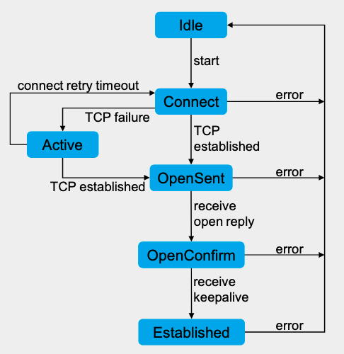

# Border Gateway Protocol (BGP)
#bgp #bfd #Routing-objects
+ Border Gateway Protocol (BGP): https://docs.fortinet.com/document/fortigate/7.6.4/administration-guide/750736/bgp
+ Bidirectional Forwarding Detection (BFD): https://docs.fortinet.com/document/fortigate/7.6.4/administration-guide/771813/bfd
+ Routing objects: https://docs.fortinet.com/document/fortigate/7.6.4/administration-guide/654952/routing-objects
---
```table-of-contents
title: 
style: nestedList # TOC style (nestedList|nestedOrderedList|inlineFirstLevel)
minLevel: 0 # Include headings from the specified level
maxLevel: 0 # Include headings up to the specified level
include: 
exclude: 
includeLinks: true # Make headings clickable
hideWhenEmpty: false # Hide TOC if no headings are found
debugInConsole: false # Print debug info in Obsidian console
```
---
## BGP Overview
- Border Gateway Protocol (BGP) is a standardized **Exterior Gateway Protocol (EGP)**. 
- Differs from interior protocols like **RIP, OSPF, and EIGRP**, which are **Interior Gateway Protocols (IGPs)**.
- **BGPv4** is the current version in widespread use.
### Purpose and Function
- Designed for routing **between Autonomous Systems (ASes)**, not within them.
- Operates as a **Path Vector protocol**, using:
    - **AS Path length** as a primary factor.
    - Additional BGP **attributes** instead of traditional IGP metrics (e.g., distance or cost).
- Forms the backbone routing protocol of the **Internet**, which consists of interconnected ASes.
### Autonomous System Numbers (ASNs)
- ASN is a **16-bit identifier**, ranging from **1–65535**.
- **64512–65535** are reserved for **private/internal use**.
### Transport
- BGP uses **TCP port 179** to reliably exchange routing information.
---
## BGP Components
### BGP Speaker or Peer
 - A router that both sends or receives Border Gateway Protocol (BGP) routing information.
### BGP Session
- The communication link established between two BGP peers for exchanging routing data.
---
## BGP Session Types
### Internal BGP (iBGP)
- Formed between routers **within the same Autonomous System (AS)** or **within the same BGP confederation**.
- Routes learned via iBGP are installed in the RIB with an **administrative distance (AD) of 200**.
### External BGP (eBGP)
- Formed between routers **in different Autonomous Systems**.
- Routes learned via eBGP are installed in the RIB with an **administrative distance (AD) of 20**.
---
## AS Types
### Stub AS
- An AS that only handles **local traffic** and has **a single connection** to another AS.
- **Characteristics:**
    - Only one exit point to the Internet or another AS.
    - Routes traffic that originates and terminates **within the AS**.
### Multihomed AS
- An AS that handles **local traffic only**, but has **multiple connections** to different ASes.
- **Characteristics:**
    - Multiple exit points for redundancy or load balancing.
    - Still does not provide transit for other ASes.
### Transit AS
- An AS that handles **local traffic** and also **transit traffic** (traffic passing through to other ASes).
- **Characteristics:**
    - Provides connectivity between other ASes.
    - Can originate, terminate, and forward traffic.
---
## Split Horizon

- **iBGP Split-Horizon Rule:** iBGP routers do **not** advertise routes learned from one iBGP peer to another.
- **Prevents routing loops** within the autonomous system (AS).
- To ensure all routers learn all prefixes inside the AS, a **full iBGP mesh** must be created among all iBGP routers.

---
## Route Reflectors
### The Problem Route Reflectors Solve
Inside one autonomous system (AS), routers use **iBGP** to exchange BGP routes.
But iBGP has a rule called **split horizon**:

> **An iBGP router cannot pass along a route it learned from another iBGP router.**  
> (Otherwise, routing loops could happen.)
#### What this means:
Every iBGP router must directly peer with every other iBGP router.

This is called **full mesh**.
#### Why this is a problem:
If you have many routers, the number of sessions grows very fast.
Example:
- With 3 routers → 3 connections
- With 10 routers → 45 connections
- With 50 routers → 1225 connections
This becomes hard to manage.
### What Route Reflectors Do
A **Route Reflector (RR)** is a special iBGP router that _breaks_ the full-mesh requirement.  
It is allowed to **forward iBGP-learned routes to other iBGP routers.**

> Think of the RR as a “post office” for BGP routes inside the AS.

Instead of every router talking to every other router,  
all routers talk only to the RR.
### Route Reflector Clients
Routers that connect to, and rely on, the RR are called **clients**.
#### How it works:
- Clients send all their BGP updates to the RR.
- The RR reflects those routes to:
    - other clients
    - other RRs
    - border routers

So clients do NOT have to peer with each other.
### Route Reflector Clusters
A **cluster** = one RR + its clients.  
Large networks may have multiple clusters, and multiple RRs.

This keeps things organized and prevents single points of failure.
#### Simple Example
Imagine a company network with 5 routers:
```
R1 — core router
R2
R3
R4
R5
```
#### Without RRs:
- Every router needs an iBGP session with every other router.
- 5 routers → 10 iBGP sessions.
#### With a Route Reflector:
Let **R1** be the RR.  
All others (R2–R5) are clients.
```
R2 →|
R3 →|→   R1 (RR)
R4 →|
R5 →|
```
**Only 4 sessions**, and everyone learns every route.

#### Multi-Cluster Example
If the AS grows, you might divide routers into clusters:
```
Cluster 1:
   RR1
   R2, R3

Cluster 2:
   RR2
   R4, R5

RR1 ↔ RR2
```
- Routers inside a cluster talk only to their RR.
- RRs share information between clusters.

This scales much better in large networks.

---
## RIBs (Routing Information Bases)

A BGP router stores route information in **three logical tables** called **RIBs**.  
Think of them as _three inboxes_ that process routing information step by step.

The three RIBs are:
1. **RIB-in**
2. **Local RIB**
3. **RIB-out**

Let's break them down using simple words and examples.
### 1. RIB-in — “Everything I heard”

The **RIB-in** contains **all the routes a router receives** from its BGP neighbors _before_ any filtering or decisions. It is the raw inbox.

> The RIB-in contains unprocessed routing information learned from inbound update messages.

Example:
Router R1 receives these routes from its neighbor:
- 10.0.0.0/8
- 172.16.0.0/12
- 192.168.1.0/24

Even if R1 plans to ignore some of them, **all three go into RIB-in** first.
### 2. Local RIB — “What I decide to keep”
The **Local RIB** contains routes the router has **accepted** after applying:
- filters,
- route maps,
- policies.

This is the router’s **“cleaned-up” inbox**.  
Only the routes the router actually wants are kept.

> Local RIB contains routing information that the BGP speaker selects after applying its local policies.

Example:
Continuing from R1:
RIB-in had 10.0.0.0/8, 172.16.0.0/12, 192.168.1.0/24.

A filter says: “Block 192.168.1.0/24.”

So the **Local RIB** ends up with:

- 10.0.0.0/8
- 172.16.0.0/12

Only the accepted routes remain.
### 3. RIB-out — “What I choose to send out”

The **RIB-out** is the list of routes the router decides to advertise to its BGP neighbors.

Before sending routes out, the router may apply:
- outbound filters,
- route maps,
- attribute changes.

> RIB-out contains the routing information selected to advertise to peers.

Example:
R1’s Local RIB has:
- 10.0.0.0/8
- 172.16.0.0/12

But R1 wants to advertise _only_ 10.0.0.0/8 to a neighbor.

Thus, the **RIB-out** contains:
- 10.0.0.0/8

This is like your **“outbox”** — messages you choose to send.
### Putting It All Together
```
BGP RX → RIB-in → Inbound Filter → Local RIB → Outbound Filter → RIB-out → BGP TX
           ^                                          ^
       received routes                       routes to advertise
```
1. **RIB-in:** “Everything I heard.”
2. **Local RIB:** “What I kept after filtering.”
3. **RIB-out:** “What I decide to tell others.”
---
## BGP Attributes

When BGP learns multiple possible paths to a destination, it must choose **the best one**.  
To make that decision, BGP looks at **attributes** — pieces of information attached to each route.

Think of BGP attributes as **labels** on a package that help you decide the best delivery path.
### Four Types of BGP Attributes

BGP Attributes divides attributes into **four categories**:  
1. **Well-known mandatory**
2. **Well-known discretionary**
3. **Optional transitive**
4. **Optional non-transitive**
### 1. Well-Known Mandatory Attributes

These **must** be present in every BGP route advertisement.  
If they’re missing → the route is rejected.

In other words:

> “You must attach these labels to _every_ route.”

Important ones:
- **AS_PATH**
- **ORIGIN**
- **NEXT_HOP**

Example of a delivery analogy:  
It’s like a package needing the **destination address**, **sender**, and **return address** — otherwise it can’t be delivered.
### 2. Well-Known Discretionary Attributes

These attributes are common but **not required** for every route.
- LOCAL_PREF
- ATOMIC_AGGREGATE

Example:  
It’s like optional shipping instructions:  
“Fragile” or “keep upright” — helpful, but the package can still be shipped without them.
### 3. Optional Transitive Attributes

These attributes may or may not be present, but if a router doesn’t understand them, it **still passes them along** to the next AS.
- COMMUNITY    
- AGGREGATOR

Think of this as:  
“I don’t know what this label means, but I’ll keep it on the package in case someone else needs it.”
### 4. Optional Non-Transitive Attributes

If a router doesn’t understand these, it **drops them** and does _not_ pass them to other ASes.
- MULTI_EXIT_DISC (MED)

This is like a note meant only for the local post office.  
If another post office sees it and doesn’t understand it, they simply remove it.
### Key Attributes
#### AS_PATH (Well-known mandatory)
Shows the list of autonomous systems the route has passed through.

Used for: **picking the shortest path**.

Example
Route A: AS_PATH = 64512 → 64520 → 64530  
Route B: AS_PATH = 64512 → 64599

Route B has fewer AS hops → **preferred**.
#### NEXT_HOP (Well-known mandatory)
The IP address of the next router to send traffic to.

Example:  
To reach 10.0.0.0/8, send traffic to **192.0.2.1**.
#### ORIGIN(Well-known mandatory)
+ Indicates how the route originated (IGP, EGP, or Incomplete).
+ It tells how a route was first put into BGP — in other words, where did this route come from originally?
+ The ORIGIN value is one of the early “tie-breakers” in the best-path selection process (step 5 in FortiGate’s list).

| ORIGIN Code | Name               | Meaning (in simple words)                                                                                                                                                                                  | How it usually gets set                                                                                                                | Preference (lower = better) |
| ----------- | ------------------ | ---------------------------------------------------------------------------------------------------------------------------------------------------------------------------------------------------------- | -------------------------------------------------------------------------------------------------------------------------------------- | --------------------------- |
| **0**       | **IGP**            | The route was learned **inside the same AS** using an internal routing protocol (like OSPF, RIP, static, connected). This is the most trusted way.                                                         | When you redistribute a route from OSPF/static into BGP, or use the `network` command.                                                 | **Best** (wins)             |
| **1**       | **EGP**            | The route came from an old exterior protocol (EGP – the predecessor of BGP). Almost never seen today.                                                                                                      | Very rare nowadays.                                                                                                                    | Medium                      |
| **2**       | **Incomplete / ?** | Nobody really knows how this route got into BGP. Usually it was redistributed from somewhere without proper origin info (e.g., redistributed from another BGP speaker or manually created). Least trusted. | When one AS re-advertises a route received from eBGP without changing the origin, or when using `redistribute` without extra settings. | **Worst** (loses)           |

Lower values mean “better.”
#### LOCAL_PREF (Well-known discretionary)
+ LOCAL_PREF = Local Preference
+ It is the most powerful way to control which way traffic leaves your own network (AS).
+ Used **inside one AS** to decide the preferred exit point.
+ It is never sent to other companies/ISPs (it does not cross AS borders).
+ Higher LOCAL_PREF = better path.

Example:  
Your company (AS 65000) has **two internet connections**:
- Link A → ISP-FAST (100 Gbit/s, low latency, expensive)
- Link B → ISP-CHEAP (10 Gbit/s, higher latency, cheap backup)

You want **all outgoing traffic** to normally leave via the fast ISP, but you still keep the cheap ISP as backup.

You configure on your border routers:
```
config router bgp
    config neighbor
        edit "ISP-FAST"
            set route-map-in "SET-HIGH-LOCALPREF"
        next
        edit "ISP-CHEAP"
            set route-map-in "SET-LOW-LOCALPREF"
        next
    end
end

config route-map
    edit "SET-HIGH-LOCALPREF"
        config rule
            edit 1
                set set-local-preference 200   ← higher = better
            next
        end
    next
    edit "SET-LOW-LOCALPREF"
        config rule
            edit 1
                set set-local-preference 50    ← lower = worse
            next
        end
    next
end
```
Result inside your entire AS:
- Every router sees routes from ISP-FAST with LOCAL_PREF = 200
- Every router sees routes from ISP-CHEAP with LOCAL_PREF = 50 → **All routers automatically prefer ISP-FAST for outgoing traffic** (because 200 > 50)

If the fast link goes down, LOCAL_PREF 50 is still valid → traffic automatically switches to the backup ISP. When the fast link comes back up, traffic automatically switches back. Perfect!
##### Where LOCAL_PREF Stands in the Decision Process
In FortiGate’s best-path list (slide 343), LOCAL_PREF is **step 2** – very early and very strong:
1. Highest Weight (Cisco-only, FortiGate ignores it)
2. **Highest LOCAL_PREF** ← this one almost always decides the winner inside your AS
3. Locally originated
4. Shortest AS-PATH 
5. … and so on

That’s why network engineers say: 
**“LOCAL_PREF is the big knob for outbound traffic engineering.”**

| Attribute       | Scope                  | Direction it influences | Preference rule | Typical values               |
| --------------- | ---------------------- | ----------------------- | --------------- | ---------------------------- |
| LOCAL_PREF      | Only inside your AS    | Outbound (exit) traffic | Higher = better | 100 (default), 50–500 common |
| AS_PATH prepend | Sent to other ASes     | Inbound traffic         | Longer = worse  | —                            |
| MED             | Sent to neighboring AS | Inbound traffic (weak)  | Lower = better  | 0–4 billion                  |
#### MED — Multi Exit Discriminator (Optional non-transitive)
**MED** is a polite **hint** you send to **another company (another AS)** saying:  
“Hey, if you have multiple connections to my network, please come in through **this** door — it’s better for me.”
- **Lower MED = better** (preferred entry point)  
- Default MED = 0 (which is the best possible)  
- It is **optional** and **non-transitive** → it usually only works between **directly connected** ASes (you and your ISP, or you and a peer).

Think of MED as a little sign on your front doors when someone wants to visit your house (your AS):

```
Your Company (AS 65000)
┌──────────────────────┐
│   Door A (London)     │ ← You put a sign: MED = 0   (please use this one!)
│   100 Gbit/s link     │
├──────────────────────┤
│   Door B (Frankfurt)  │ ← You put a sign: MED = 100 (backup, slower link)
│   10 Gbit/s link      │
└──────────────────────┘
         ↑                ↑
     ISP’s network (AS 65001)
```

Because Door A has **lower MED (0 < 100)**, the ISP will send **all traffic destined to your company** through the fast London link — exactly what you wanted!
##### Real-World Example (The Classic Use Case)
You are a customer with **two BGP links** to the **same ISP**:
- Primary link: 100 Gbit/s in New York  
- Backup link: 10 Gbit/s in New Jersey

You want the ISP to send you traffic over the fast link whenever possible.

On your FortiGate(s), you configure:

```text
config router bgp
    config neighbor
        edit "ISP-NYC"          # primary link
            set capability-default-originate enable
        next
        edit "ISP-NJ"           # backup link
            set send-med 100    # ← higher = worse for inbound
        next
    end
end
```

Result:  
- Routes advertised over the NYC link → MED = 0 (default) → **preferred**  
- Routes advertised over the NJ link → MED = 100 → **less preferred**

The ISP sees the lower MED on the NYC path and automatically sends all your inbound traffic there. If the NYC link fails, the ISP automatically fails over to NJ.
##### Very Important Things to Know About MED

| Fact                                              | What It Means in Practice                                                             |
| ------------------------------------------------- | ------------------------------------------------------------------------------------- |
| Only compared **between the same neighboring AS** | MED from ISP-A is **never** compared to MED from ISP-B. It only works inside one ISP. |
| Often ignored or stripped                         | Many ISPs remove or ignore MED by default. You have to ask them to honor it.          |
| Non-transitive                                    | If your ISP re-advertises your routes to someone else, the MED is usually removed.    |
| Step 6 in FortiGate’s decision list               | It’s quite late — Weight, Local_Pref, AS_PATH, Origin all win over MED.               |
| Lower = better (opposite of Local_Pref)           | Local_Pref: higher = better (outbound), MED: lower = better (inbound)                 |

##### Quick Comparison: The Big Three Traffic Engineering Tools

| Tool          | Direction it Controls | Scope                     | Preference Rule     | Who Sees It?                  |
|---------------|------------------------|---------------------------|---------------------|--------------------------------|
| **Local_Pref**   | Outbound (exit)       | Only inside your AS       | Higher = better     | Only your own routers          |
| **AS_PATH prepending** | Inbound (entry)     | Everyone on the internet  | Longer = worse      | Everyone (very strong)         |
| **MED**          | Inbound (entry)       | Usually only your direct ISP | Lower = better      | Only the neighboring AS (weak) |

#### COMMUNITY (Optional transitive)

**COMMUNITY** = **sticky labels (tags)** that you can stick on BGP routes.

These labels travel with the route across the internet (they are **transitive** – they survive even when the route passes through many different companies).  
Whoever receives the route can look at the labels and decide:  
“Do I want to treat this route specially?”

Think of it like putting colored stickers on letters you send:

- Red sticker = “This is customer traffic – treat it nicely!”  
- Blue sticker = “This is backup link – only use if everything else is dead.”  
- Black sticker = “Do NOT announce this prefix to anyone else!”
##### The Most Famous Communities (Used by Almost Every ISP)

| Community Value         | Meaning (what the receiver usually does)                              | Real-World Example |
|-------------------------|-----------------------------------------------------------------------|--------------------|
| **65000:666**           | “Blackhole this prefix” – drop all traffic to it (used against DDoS) | You are under attack on 203.0.113.10/32 → you ask your ISP to add this community |
| **65001:100**           | Set Local_Pref = 100 (normal customer route)                         | Default for your prefixes |
| **65001:80**            | Set Local_Pref = 80 (backup/customer route)                          | You announce your prefix via a slower backup link |
| **65001:90**            | Set Local_Pref = 90 (peer route)                                     | Routes learned from another ISP you peer with |
| **no-export** (well-known) | Do NOT send this route outside your own AS                          | You announce an internal subnet by mistake → slap no-export on it |
| **no-advertise** (well-known) | Do NOT send this route to ANY BGP neighbor (even inside your AS)  | Super private prefixes |

Example

You have two internet links:
- Primary ISP (AS 65001) – fast and expensive  
- Backup ISP (AS 65002) – slow and cheap

You want the whole internet to prefer your primary ISP, but keep the backup as failover.

You configure on your FortiGate:

```text
config router route-map
    edit "TAG-PRIMARY"
        config rule
            edit 1
                set set-community "65001:100"   # normal priority
            next
        end
    next
    edit "TAG-BACKUP"
        config rule
            edit 1
                set set-community "65001:80"    # lower priority
            next
        end
    next
end

config router bgp
    config neighbor
        edit "Primary-ISP"
            set route-map-out "TAG-PRIMARY"
        next
        edit "Backup-ISP"
            set route-map-out "TAG-BACKUP"
        next
    end
end
```

Result:  
- Primary ISP receives your prefixes with community 65001:100 → sets Local_Pref 100 → preferred by everyone  
- Backup ISP receives your prefixes with community 65001:80 → sets Local_Pref 80 → only used if primary disappears

This is how almost every company does **inbound traffic engineering** when they can’t use MED or AS-path prepending is too aggressive.
##### Quick Facts Table

| Feature               | COMMUNITY                                      |
|-----------------------|--------------------------------------------------|
| Type                  | Optional transitive (travels everywhere)        |
| Format                | Usually **AS:number** (e.g., 65001:80) or well-known names |
| Main use              | Tell other networks “please treat my route like this” |
| Most common actions   | Change Local_Pref, prepend AS_PATH, blackhole, no-export |
| Who decides meaning?  | The **receiver** (your ISP decides what 65001:80 actually does) |

---
## Route Selection
A router may learn **multiple possible paths** to reach the same destination.  
BGP must pick **one “best” route** (unless ECMP is enabled).

To do this, BGP compares route attributes in a **specific order**, called the **route selection process**.

Think of this as BGP’s **tie-breaker list** — it checks rule #1 first, and only moves to rule #2 if the first rule is tied, and so on.
### BGP Route Selection

#### 1. Highest weight
(Weight is Cisco-proprietary; FortiGate treats it like a custom value.)

- Bigger weight = better route.
- Useful when **you** want to force traffic a certain way.
#### 2. Highest local preference (LOCAL_PREF)
Used **inside one AS** to choose the best exit point. 

Higher LOCAL_PREF = more preferred.
#### 3. Prefer routes that originated locally
If the router itself created a route (for example, through `network` or redistribution), it prefers it over routes learned from neighbors.
#### 4. Shortest AS path
Routes with **fewer AS hops** are considered shorter and preferred.
#### 5. Lowest origin type
Origin types (best to worst):
1. IGP
2. EGP
3. Incomplete
#### 6. Lowest MED (Multi-Exit Discriminator)
Lower MED = “Enter my AS through this router — it's better.”
#### 7. Lowest IGP metric to the NEXT_HOP
This checks the internal metric (inside your AS) to reach the next hop router.
- Lower metric = closer = better.
#### 8. Prefer EBGP routes over IBGP routes
If all previous rules tie, routes learned from **external neighbors** (EBGP) are preferred over those learned internally (IBGP).
#### 9. If ECMP is enabled: install up to 10 equal-cost routes
ECMP = Equal Cost Multi-Path.

- If multiple routes tie on all previous rules, FortiGate can install **up to 10** of them.
- Traffic is shared across the equal routes.
#### 10. Lowest router ID
Router ID = unique identification for a BGP router.

If absolutely everything else matches, use the router with the **lowest router ID**.
##### Easy Real-Life Analogy
Imagine you’re picking the best route to drive somewhere.

You evaluate:
1. Is there a route you personally prefer?
2. Which road has fewer traffic rules?
3. Which one starts closer to you?
4. Which has fewer toll booths (AS hops)?
5. Which road is officially recommended (origin)?
6. Which road has lower congestion warnings (MED)?
7. Which road is physically nearest to join (IGP metric)?
8. Prefer main highways (EBGP) over back streets (IBGP).
9. If two routes tie, use both (ECMP).
10. If still tied, pick the direction with the lower sign number.
### Quick Summary (Super Simple)
BGP compares paths in this order:
1. Highest weight
2. Highest LOCAL_PREF
3. Originated locally
4. Shortest AS_PATH
5. Lowest origin type
6. Lowest MED
7. Lowest IGP metric to next hop
8. EBGP > IBGP
9. ECMP (if enabled)
10. Lowest router ID

This ensures BGP always picks a single “best path” in a predictable way.

---
## FortiGate BGP Implementation
**Three key things** you need to understand about how FortiGate handles BGP:
1. **Scaling capabilities**
2. **How FortiGate originates (or doesn’t originate) prefixes**
3. **How FortiGate accepts routes**

Let’s break each down with examples.
### 1. Scaling Capabilities
FortiGate does **not** have fixed, hardcoded limits for BGP.

> Limits on neighbors, routes, and policies depend on available system memory.
#### What this means:
- You can have many BGP neighbors
- Many routes
- Many filters, route maps, and policies
- ⚠️**The only real limitation is RAM**
### 2.  FortiGate Does Not Advertise Anything by Default
**❗** By default, when you turn on BGP, FortiGate:
- Does **not** originate any prefixes
- Does **not** advertise any routes

> By default, BGP doesn’t originate any prefix. Redistribution or policies are required.
#### Why?
FortiGate wants to avoid accidentally advertising internal networks to the outside world.
#### How do you make it advertise routes?
You have **two main options**:
#### Option A: Redistribute routes into BGP
**Protocol redistribution** means:

> Taking routes learned from one routing source (like static routes, connected routes, OSPF, RIP) and injecting them into **BGP** so they can be advertised to BGP peers.

FortiGate does **not** advertise anything in BGP by default.  
Redistribution is one of the main ways to make it announce routes.

Because BGP only advertises routes that are:
- explicitly configured using the **network** command, or
- **redistributed** from another routing protocol.

So if you have important routes (static or connected networks, or OSPF-learned networks), you need to **redistribute** them so BGP can pass them to neighbors.

You can redistribute:
- Connected routes
- Static routes
- Routes learned via OSPF, RIP, etc.

Example:
```
config router bgp
    config redistribute "static"
        set status enable
    end
end
```
This tells FortiGate:  
“Take my static routes and announce them in BGP.”
#### Option B: Use the network command
You manually specify prefixes to advertise:
```
config router bgp
    config network
        edit 1
            set prefix 10.0.0.0/8
        next
    end
end
```
But there’s a rule:
####  ❗Rule:
>  - ❗The prefix must exist as an **active route** in the routing table.
>  - ❗If it’s not active, FortiGate won’t advertise it.

This can be changed with:
```
set network-import-check disable
```
Then FortiGate will advertise even if the prefix isn’t active.
#### 3.  FortiGate Accepts All Routes by Default
FortiGate is very open by default.

> **❗** By default, all routes received are accepted.

This is convenient but risky in large environments.
Example:
If your ISP sends you 900,000 routes, FortiGate will accept all of them unless you filter.
#### How Do You Control What You Accept?
You use:
- **Prefix-lists**
- **Route-maps**
- **Filters**
Example:

```
config router prefix-list
    edit "filter-subnets"
        config rule
            edit 1
                set prefix 10.1.0.0/16
                set action deny
            next
            edit 2
                set prefix 10.0.0.0/8
                set action permit
            next -----------------------------> ❗By default, traffic not matching the prefix list is denied
        end
    end
end
config router bgp
	config neighbor
		edit 10.3.1.254
		set prefix-list-in filter-subnets
		next
	end
end
```

Then apply the filter to a neighbor’s incoming routes.
### SUMMARY
Here is the whole FortiGate BGP behavior summarized:
  - **No hard limits**
	  - Your FortiGate can scale depending on its memory.
	  - Smaller devices = fewer routes, larger = full Internet table.
  -  **Does not generate routes automatically**
	  - You need to **redistribute** or **declare prefixes** manually.
 - **Accepts everything by default**
	 - You must **add filters** if you want to control what you receive.
---
## BGP Route Filtering Options (Access Lists vs. Prefix Lists vs. Route Maps)

In BGP, you often don’t want to accept or advertise **every** route you hear about. You filter them so you only learn the routes you want and only send the routes you’re allowed to send.

There are three main tools to do this on FortiGate (and most routers):

1. **Access Lists** (the simplest)
2. **Prefix Lists** (simple but smarter about subnet lengths)
3. **Route Maps** (the powerful one – it can do everything the others do, plus change route attributes)

Here’s the easy breakdown:

### Access Lists (basic IP filter)
- Works exactly like a normal firewall ACL.
- You say “permit 10.0.0.0 0.0.255.255” or “permit 10.0.0.0/8”.
- It only looks at the prefix and the mask you write. It does **exact match** or **wildcard match**.
- You cannot say “permit anything inside 10.0.0.0/8 that is /24 or smaller” → you have to write every single line.

**Example**  
You only want to accept the summary 172.16.0.0/12 from a peer, nothing more specific:

```text
config router access-list
    edit "only-summary"
        config rule
            edit 1
                set prefix 172.16.0.0 255.240.0.0   ← this is 172.16.0.0/12
                set action permit
            next
            edit 2
                set action deny
            next
        end
    next
end

config router bgp
    config neighbor
        edit "1.1.1.1"
            set distribute-list-in "only-summary"
        next
    end
end
```

Result: Peer can send you 172.16.1.0/24, 172.20.0.0/16, etc. → all denied. Only the exact /12 is accepted.
### Prefix Lists (better for networks)
- Designed specifically for filtering routes, not packets.
- You can use **ge** (greater or equal) and **le** (less or equal) to define a range of prefix lengths.

**Real-life example everyone uses**  
Your company owns 203.0.113.0/24. You advertise more-specific subnets to customers but you only want to **accept back** the /24 or larger (i.e. never accept someone else’s longer prefixes inside your block).

```text
config router prefix-list
    edit "my-block"
        config rule
            edit 1
                set prefix 203.0.113.0 255.255.255.0
                set ge 24
                set le 24 ----> only exactly /24 (or you can do le 32 for everything)
                set action permit
            next
            edit 2
                set action deny
            next
        end
    next
end

config router bgp
    config neighbor
        edit "customer"
            set prefix-list-in "my-block"
        next
    end
end
```

This is impossible to do cleanly with an access list – you would need 256 lines!
### Route Maps (the Swiss Army knife)
Route maps can:
- Match using access-list, prefix-list, AS-path, community, etc.
- Do multiple match statements (match ALL or match ANY depending on how you write it)
- **Set** or change BGP attributes (local-pref, MED, community, next-hop, etc.)
- Be used for both in and out direction
- Also filter or modify routes that come from static/connected/OSPF/etc. when you redistribute them into BGP

**Most common real example – Prefer one ISP over another**

```text
config router access-list
    edit "customer-routes"
        config rule
            edit 1
                set prefix 198.51.100.0 255.255.255.0
                set action permit
            next
        end
    next
end

config router route-map
    edit "prefer-ISP1"
        config rule
            edit 10
                set match-ip-address "customer-routes"
                set set-local-preference 200   ← make these routes more preferred
            next
            edit 20
                set set-community 65100:100   ← tag them
            next
        end
    next
end

config router bgp
    config neighbor
        edit "ISP1-peer"
            set route-map-in "prefer-ISP1"
        next
    end
end
```

So when ISP1 sends you the customer prefix 198.51.100.0/24, FortiGate automatically sets local-preference to 200 → you will use ISP1 for that customer even if ISP2 also sends the same prefix.

Another super common example – Only advertise your own prefixes to the Internet, nothing else**

```text
config router prefix-list
    edit "my-prefixes"
        config rule
            edit 1
                set prefix 203.0.113.0 255.255.255.0
                set le 29
                set action permit
            next
        end
    next
end

config router route-map
    edit "out-to-ISP"
        config rule
            edit 1
                set match-ip-address "my-prefixes"
            next
            edit 2
                set action deny   ← deny everything else
            next
        end
    next
end

config router bgp
    config neighbor
        edit "ISP-upstream"
            set route-map-out "out-to-ISP"
        next
    end
end
```

This is the standard safe way: you only ever leak your own networks, never customer or transit routes.

### Quick comparison table (exactly what the slide says, but in plain English)

| Tool          | How simple? | What it can match                  | Can it change attributes? | Typical use case                                      |
|---------------|-------------|------------------------------------|---------------------------|--------------------------------------------------------|
| Access List   | Very simple | Exact prefix + wildcard mask       | No                        | Very small networks, quick & dirty filters            |
| Prefix List   | Simple      | Prefix + length range (ge/le)      | No                        | Filtering your own block, customer cones – super common |
| Route Map     | Powerful    | Anything (prefix, AS-path, community, etc.) + multiple conditions | Yes (local-pref, MED, community, weight, etc.) | Real production networks – policy, preference, tagging |

**Bottom line**  
- 90 % of the time you will use **prefix-lists** + **route-maps**.  
- You use **route-maps** when you need to do something clever (change local-preference, prepend AS-path, add communities, etc.).  
- Access lists are still there for very simple cases or when you already have an ACL for firewalling and want to reuse it.
---
## BGP Commands Comparison on FortiGate

FortiGate has its own set of "get router info bgp ..." commands. These four are the ones you'll use 99% of the time.
1. **get router info bgp summary**  
   → The "dashboard" or quick health check. One screen tells you everything at a glance.

   What it shows:
   - Your local AS number
   - Every neighbor's IP, their AS, how long they've been up
   - State (Established = good, anything else = problem)
   - How many prefixes (routes) you've received from them
   - Packet counters (helps spot if updates are stuck)

   **Real example** – You run this first when someone says "Internet is slow":  
   ```
   FGT # get router info bgp summary

   BGP router identifier 172.16.1.1, local AS number 65100
   BGP table version is 1250
   2 BGP AS-PATH entries
   0 BGP community entries

   Neighbor        V    AS   MsgRcvd MsgSent   TblVer  InQ OutQ Up/Down  State/PfxRcd
   100.64.1.1      4  65001  8421    8415      1250    0    0 6d12h       12456
   100.64.2.1      4  65002  1562    1589      1250    0    0 01:23:45    9876
   ```

   You immediately see: both peers are Established, you've learned ~12k routes from ISP1 and ~9k from ISP2, and one peer has only been up for 83 minutes → probably flapped recently.

2. **get router info bgp neighbors**  
   → The deep dive into ONE neighbor (or all if you don't specify IP).

   This is the command you run when the summary shows a neighbor is not Established or you want to know why it's misbehaving.

   What it shows:
   - Peer IP and router-ID
   - Remote AS
   - BGP state + how long in that state
   - Capabilities (graceful restart, 4-byte AS, route-refresh, etc.)
   - Timers
   - Last time it sent/received keepalive or update
   - Often the error if it's stuck in Active/Idle/OpenSent, etc.

   **Real example** – Neighbor stuck in Active? Run:
   ```
   get router info bgp neighbors 100.64.1.1
   ```
   You'll see something like "No route to host" or "Connect retry timer" running → tells you it's a connectivity or firewall policy issue.

   This command is gold when peering isn't coming up.

3. **get router info bgp network**  
   → Shows what YOU are advertising into BGP (the "BGP table" from your perspective – your own networks + redistributed routes).

   Basically: "What routes am I telling the world about?"

   Very useful when a customer calls and says "I can't see our prefix 203.0.113.0/24 on the Internet".

   Example output snippet:
   ```
   Network            Next Hop        Metric LocPrf Weight Path
   *> 10.0.0.0/8        0.0.0.0         0         32768 i
   *> 192.168.1.0/24    0.0.0.0         0         32768 i
   ```

   The "i" at the end means originated by this router (usually from redistribute connected/static).

4. **get router info routing-table bgp**  
   → Shows the actual routes installed in the routing table that came from BGP (the ones FortiGate is really using to forward traffic).

   This is different from #3 because BGP might have learned 50,000 routes, but after filters, local-pref, etc., only 12,000 make it into the real routing table.

   **Real example** – You want to check if you're really preferring ISP1 for Netflix traffic:
   ```
   FGT # get router info routing-table bgp

   Routing table for VRF=0
   B    1.0.0.0/8 [200/0] via 100.64.1.1 (recursive via wan1), 3d12h
   B    8.8.8.8/32 [20/0] via 100.64.2.1 (recursive via wan2), 02:10:22
   ```

   You see the "B" means BGP, the [20/0] or [200/0] is admin-distance/metric, and which interface it's actually exiting.

### Quick cheat-sheet (every FortiGate BGP admin has this memorized)

| Command                             | What you run when…                           | Typical use case                                       |
| ----------------------------------- | -------------------------------------------- | ------------------------------------------------------ |
| `get router info bgp summary`       | "Is BGP basically working?"                  | Daily health check, first command when troubleshooting |
| `get router info bgp neighbors`     | "Why is this specific peer not working?"     | Peering down, stuck state, capability mismatch         |
| `get router info bgp network`       | "Are we advertising our prefixes correctly?" | Customer can't see their IP space                      |
| `get router info routing-table bgp` | "What BGP routes are actually being used?"   | Checking best-path selection, load-balancing, leaks    |

---
## Use Case 1 – Configure ECMP With BGP Routes on FortiGate

**What is ECMP?**  
ECMP = Equal-Cost Multi-Path.  
In simple terms: when your FortiGate sees **two or more paths that look exactly the same** (same cost, same preference, same everything BGP cares about), instead of picking just one winner, it can put **all** of them into the routing table and share (load-balance) the traffic across them.

By default, BGP is picky and only installs **one** best path, even if the others are identical.  
So if you have two ISP links and both advertise the same prefixes with identical attributes, all your traffic might go out only one link → one link is bored, the other is crying from overload.

FortiGate fixes this with two simple toggles:

- `set ebgp-multipath enable` → use when the equal paths come from **different ASes** (most common: two different ISPs)
- `set ibgp-multipath enable` → use when the equal paths come from inside your own AS (route-reflectors, multiple iBGP peers, etc.)

Once enabled, FortiGate will install up to the maximum number of equal paths (controlled by the global `config system ecmp-max-paths` setting, default is 255 on big boxes) and load-balance traffic across them (per-flow hash by default).

**Real-life example #1 – Dual ISP, same prefixes (the classic one everyone wants)**

You have two ISPs:

- ISP1 (AS 65001) advertises 0.0.0.0/0 (default) or full table  
- ISP2 (AS 65002) advertises the exact same routes

Both paths have identical local-pref (100, same AS-path length, etc.

**Without** ebgp-multipath:

```
get router info routing-table bgp | grep 1.1.1.1
B    1.1.1.1/32 [20/0] via 100.64.1.1, wan1, 5d12h
```

Only one path → all traffic to Cloudflare goes out wan1, wan2 sits idle.

**With** ebgp-multipath enable:

```
get router info routing-table bgp | grep 1.1.1.1
B    1.1.1.1/32 [20/0] via 100.64.1.1, wan1, 5d12h
B>*  1.1.1.1/32 [20/0] via 100.64.2.1, wan2, 5d12h
```

Now FortiGate load-balances new sessions across both links → you actually use the full bandwidth you paid for.

**Real-life example #2 – The exact scenario in the slide (same BGP next-hop, multiple paths to it)**

You peer with one upstream router (e.g. a cloud provider or partner) but you reach their loopback/peer-IP over **two different underlays** (two MPLS links, two VPN tunnels, two physical links, etc.).

The BGP route shows next-hop 10.100.100.1  
But to reach 10.100.100.1 you have two equal-cost routes (static, OSPF, SD-WAN members, whatever).

Without multipath → FortiGate only uses one of the underlay paths → 50 % of your bandwidth wasted.

With ebgp-multipath enable → FortiGate can recurse the BGP route over **both** underlay paths → true load balancing to that single next-hop.

The slide shows exactly this: same BGP peer, same next-hop IP, but traffic goes through ISP1 **and** ISP2 because the next-hop resolution now uses ECMP.

**The config is literally one line**

```
config router bgp
    set ebgp-multipath enable   # or ibgp-multipath enable
end
```

(Do it on both sides if the peer is also FortiGate, but usually only needed on the customer side.)

**Bonus tips every FortiGate admin learns the hard way**
- Paths must be truly **equal** (same weight, local-pref, AS-path length, MED, etc.). If one has even slightly better attribute, it wins alone.
- Also set `set ecmp-max-paths 16` (or whatever number you want) under `config system global` if you have more than a few links.
- Works great with SD-WAN too – SD-WAN rules can then steer specific traffic to preferred links while still using ECMP for the rest.
- If you use ADVPN or IPsec overlays, this + ibgp-multipath is magic for hub-and-spoke load balancing.

Bottom line: if you paid for two (or more) links and want to actually **use** them both without complicated local-pref games or SD-WAN rules, just turn on ebgp-multipath / ibgp-multipath. It’s one of the most “bang for buck” commands in FortiGate BGP. Most people enable it day one on dual-homed setups.

---
## Use Case 2 – Loopback Interfaces as BGP Source on FortiGate

Physical interfaces go down when the cable flaps, gets shut down, or you move the link to another port → BGP session dies, even if you have another perfectly good path to the same peer.  
Loopback interfaces **never go down** (they're virtual), so if you run BGP from a loopback IP, the session stays alive as long as there is **any** path between the two routers.

This is the #1 best practice in real production networks when you have redundant links to the same BGP peer (dual-homed to same ISP, MPLS dual-CE, cloud express-route with two tunnels, etc.).

**Why loopbacks are magic for BGP**
- A loopback interface is always "up/up" – it only goes down if the whole router crashes.
- You advertise the loopback IP via IGP (OSPF usually) or static routes so the peer always knows how to reach it.
- Even if one physical link dies, the IGP re-converges and traffic to the loopback just takes the other path → BGP session never flaps.

Real-life example everyone has seen:
You have two firewalls (HA pair or just two routers) connected to the same ISP router with two separate links (or two IPsec tunnels).  
If you peer BGP using the physical IPs → one link flaps → BGP session drops → routes disappear → outage.  
If you peer using loopback IPs → link flaps → IGP moves the traffic to the other link → BGP session stays up → zero packet loss.

**The three things you MUST do on FortiGate**

1. **Tell BGP to source the session from the loopback interface**
   ```text
   config router bgp
       config neighbor
           edit "100.64.1.254"          ← this is the peer's loopback IP
               set update-source loop0   ← THIS is the key line
               set remote-as 65001
               ...
   ```

2. **Enable multihop (because the peer is no longer directly connected)**
   ```text
   set ebgp-enforce-multihop enable
   ```
   Normally BGP assumes the peer is one hop away. When you source from loopback, the packets leave via a physical interface → the peer sees the packet coming from a different IP than the configured neighbor IP → it expects → it drops it unless you allow multihop.

3. **Create a firewall policy to allow TCP 179 between the loopback and the physical outbound interface**
   This is the part everyone forgets the first time and spends two hours troubleshooting.

   Example:
   ```text
   config firewall policy
       edit 1
           set name "Allow BGP from loopback"
           set srcintf "loop0"
           set dstintf "wan1"          ← or whatever your outbound interface is
           set srcaddr "local-loopback-subnet"
           set dstaddr "peer-loopback"
           set action accept
           set service "BGP"           ← TCP 179
           set schedule "always"
       next
   end
   ```
> You usually need the reverse policy too, or just make it any-any if you're lazy.

---
## Use Case 3 – The neighbor-group Command on FortiGate
In huge networks with tons of BGP peers (like SD-WAN setups where a central "hub" talks to 100+ remote "spokes"), you don't want to configure every single peer one-by-one – that's a nightmare. The `neighbor-group` command lets you create a "template" of common settings (like interface, AS number, timers) and apply it to **groups** of peers automatically, based on their IP addresses.

This saves hours of typing and makes scaling easy. It's especially awesome for **SD-WAN overlays**, where remote sites (spokes) dial in dynamically over VPN tunnels or underlays (like MPLS or Internet links), and you want all spokes on the same underlay to inherit the same BGP rules without manual tweaks.

**Key parts broken down simply:**
1. **Neighbor Group = A reusable template for BGP peers**  
   - You define a group name (e.g., "SpokeGroup1") and set shared options inside it: remote AS, local interface, keepalive timers, route-maps, etc.  
   - Any peer you add later automatically gets these settings if it matches the group.

2. **Neighbor-Range = The "who belongs here?" matcher**  
   - This ties the group to an IP subnet (e.g., 10.1.0.0/24).  
   - Any BGP peer whose IP is in that range auto-joins the group. Perfect for dynamic setups where spokes get IPs from a pool.

3. **Why SD-WAN?**  
   - In SD-WAN, the hub (central FortiGate) peers with many spokes over different underlays (e.g., ISP1 tunnels vs. ISP2 tunnels).  
   - Group by underlay: One group for ISP1 spokes (using interface "ISP1"), another for ISP2.  
   - Since spokes are often in the **same AS** (iBGP), you can enable `ibgp-multipath` in the group for ECMP load-balancing across all spokes.

**Real-life example: Hub-and-spoke SD-WAN with two ISPs**  
Imagine a company HQ (hub FortiGate) with SD-WAN to 50 remote offices (spokes). Half connect over ISP1 (IPs in 10.1.0.0/24), half over ISP2 (10.2.0.0/24). All spokes are in AS 65100 (same as hub), so it's iBGP. Without groups, you'd configure 50 individual neighbors – tedious! With neighbor-group, it's 10 lines total.

**Step-by-step config on the hub FortiGate:**

```text
config router bgp
    set as 65100
    set router-id 172.16.1.254
    set ibgp-multipath enable  # Global ECMP for all iBGP routes (optional, but good for SD-WAN)
    
    # Define the template/group for ISP1 spokes
    config neighbor-group
        edit "SpokeISP1"
            set interface "ISP1"          # All these spokes use ISP1 underlay
            set remote-as 65100           # Same AS = iBGP
            # Add other common stuff: set keepalive-timer 30, set route-map-in "customer-filter", etc.
        next
    end
    
    # Define the IP range that auto-applies the group
    config neighbor-range
        edit 1
            set prefix 10.1.0.0 255.255.255.0  # Any peer IP in this subnet...
            set neighbor-group "SpokeISP1"     # ...gets the SpokeISP1 template
        next
    end
    
    # Repeat for ISP2
    config neighbor-group
        edit "SpokeISP2"
            set interface "ISP2"
            set remote-as 65100
        next
    end
    
    config neighbor-range
        edit 2
            set prefix 10.2.0.0 255.255.255.0
            set neighbor-group "SpokeISP2"
        next
    end
end
```

**What happens now?**  
- A new spoke office dials in over ISP1 with IP 10.1.0.50 → FortiGate auto-detects it in the 10.1.0.0/24 range → applies "SpokeISP1" settings instantly (interface ISP1, AS 65100, etc.). No manual config needed!  
- BGP session comes up, routes flow, and since it's iBGP with multipath, traffic to/from that spoke load-balances over multiple paths.  
- Check it: `get router info bgp summary` shows the new peer with the group-applied settings.

**Another quick example – Non-SD-WAN, just scaling iBGP**  
You have 20 branch routers all in AS 65001, IPs in 172.16.10.0/24. Instead of 20 `config neighbor` blocks:  
- Create one neighbor-group "Branches" (set remote-as 65001, set update-source loop0).  
- One neighbor-range for 172.16.10.0/24 pointing to "Branches".  
- Boom – add a new branch? Just plug it in; BGP auto-configures.
### Quick pros/cons table (why bother?)

| Feature              | Why it's great                          | When to skip it                  |
|----------------------|-----------------------------------------|----------------------------------|
| Neighbor-Group       | Reuses config, cuts errors in big setups| Small networks (under 5 peers)  |
| Neighbor-Range       | Auto-matches dynamic/dial-up IPs        | Static peers with unique IPs    |
| With iBGP + Multipath| Easy ECMP for load-balancing spokes     | Pure eBGP (different ASes)      |

---
## BGP Convergence on FortiGate

**What is BGP Convergence?**  
In simple terms: When something changes in the network (like a link fails or a new path appears), BGP has to "converge" – meaning it updates all its route info across the whole network so traffic keeps flowing correctly. It's like the network telling everyone, "Hey, the road is blocked, take this detour instead!" But BGP is slow by design (it's built for the huge, global Internet), so convergence can take seconds to minutes, causing blackouts.

The slide breaks it into **three main steps**:
1. **Installing a new path** → BGP picks the best route and puts it into the actual forwarding tables (what routers use to send packets).
2. **Processing and finding an alternate path** → BGP crunches through all possible options to find backups.
3. **Fast failure detection and propagation** → Spot the problem quick, then flood the "bad news" to neighbors so everyone reroutes ASAP.

BGP is a **distance-vector protocol** (like RIP, but smarter): It only tells direct neighbors its full routing table (the RIB – Routing Information Base), and they pass it on. Updates happen on timers or changes, but the "convergence time" depends on:
- **RIB size** (how many routes? Full Internet table = 900k+ routes → slow!).
- **Hops × ad-interval** (long chains of routers mean delays multiply).
- **Failure detection delay** (default keepalives every 60s → too slow for real apps).

**Why does it matter?** Slow convergence = dropped calls, slow websites, angry users. In enterprises, you want it under 1-2 seconds for critical stuff like VoIP or cloud apps.

#### Ways to Speed It Up (The Optimization Tips from the Slide)
The slide gives practical fixes – think of them as "tuning your BGP engine":

1. **Stable Network (No Flapping)**  
   - **Simple words:** Ports/links that keep going up/down spam BGP with updates → wastes CPU and slows everything.  
   - **How to fix:** Use interface dampening or just fix your cables/switches.  
   - **Example:** Your office WiFi access point reboots 10x a day → BGP floods 10x with "this route is gone... oh wait, back!" → CPU spikes to 100%. Solution: Plug it into a stable switch. Result: CPU drops to 20%, convergence halves.

2. **Reduce RIB Size with Filters**  
   - **Simple words:** Don't learn/advertise the whole Internet if you don't need it – filter out junk to shrink your brain (RIB).  
   - **How to fix:** Use prefix-lists or route-maps (from earlier sections) on inbound/outbound.  
   - **Example:** You're a small company – why learn all 900k routes? Filter to just your customers + key clouds (AWS, Azure). Config: `set prefix-list-in "only-my-peers"`. Before: 900k routes, 30s convergence. After: 500 routes, 2s convergence. Boom – faster decisions.

3. **Route Reflectors for iBGP (Avoid Full Mesh)**  
   - **Simple words:** In your own AS (iBGP), every router must peer with every other (full mesh) → explosion of sessions in big networks. Route Reflectors (RRs) are "hubs" that collect updates from everyone and fan them out – like a post office instead of everyone mailing each other.  
   - **How to fix:** Pick 1-2 routers as RRs, config them to reflect routes.  
   - **Example:** 10 branch routers – full mesh = 45 sessions (math: n(n-1)/2). With 2 RRs: Just 20 sessions (each branch peers to RRs). A link fails → updates hit RRs once, then blast to all branches in 1 hop vs. 9. Convergence: 10s → 1s. (Next slide dives deeper.)

4. **Faster Failure Detection: Tune Keepalives or Enable BFD**  
   - **Simple words:** BGP checks if neighbors are alive with "keepalives" every 60s by default – too slow! Tune to 10s, or use BFD (Bidirectional Forwarding Detection) – a super-fast "heartbeat" (under 1s) that tells BGP "peer is dead NOW."  
   - **How to fix:** `set keepalive-timer 10` or `set bfd enable` on neighbors.  
   - **Example:** ISP link drops – default: Wait 180s (3 missed keepalives) to switch paths → users notice outage. With BFD: Detects in 50ms, propagates in 200ms → seamless failover. Perfect for SD-WAN where links flap.

5. **Graceful Restart for HA Failover**  
   - **Simple words:** In FortiGate HA clusters, failover restarts BGP on the new primary → it relearns routes, causing a flap. Graceful Restart pretends "I'm just napping, keep using old routes!" until I'm back.  
   - **How to fix:** `set graceful-restart enable` (next slide has config).  
   - **Example:** HA failover during maintenance – without GR: BGP withdraws all routes → 30s global outage. With GR: Peers hold routes for 180s, new primary syncs quietly → zero downtime. (Like putting "Do Not Disturb" on your router.)

### Quick Optimization Table (Prioritize These for Your Network)

| Fix                  | When to Use It               | Expected Speed Gain  | Real-World Win Example                         |
| -------------------- | ---------------------------- | -------------------- | ---------------------------------------------- |
| Stable Network       | Flaky links/devices          | 20-50% faster        | Stop port flaps → CPU free for real work       |
| RIB Filters          | Full-table peers (ISPs)      | 5-10x faster         | Learn 1k routes vs. 900k → tiny RIB            |
| Route Reflectors     | 5+ iBGP routers in AS        | 2-5x fewer sessions  | Scale to 100 branches without config nightmare |
| BFD/Keepalive Tuning | Mission-critical apps (VoIP) | Sub-second detection | Failover in 0.2s vs. 3min                      |
| Graceful Restart     | HA clusters/upgrades         | Zero-downtime        | Maintenance without user complaints            |

---
## Bidirectional Forwarding Detection (BFD)

BFD is a super-fast "ping-like" heartbeat between two routers to check if the path to a BGP peer is still working.  
It's like having a smoke detector for your BGP session: instead of waiting minutes for BGP's slow built-in timers to notice a fire (link failure), BFD screams "PROBLEM!" in less than a second.

BGP's default way of checking if a neighbor is alive = keepalive packets every 60 seconds + hold-timer 180 seconds (3 missed keepalives = dead).  
If a link dies, you can wait up to 3 minutes before BGP switches paths → bad for VoIP, video, cloud apps (users complain "Internet died!").

BFD fixes this by sending tiny, lightweight probe packets constantly (every 50–500 milliseconds usually), and if a few are missed in a row, it instantly tells BGP "peer is down – failover NOW!"

**Key advantages (why everyone enables it)**
- **Super fast detection:** <1 second (often 150–600 ms) vs. minutes with plain BGP timers.
- **Detects one-way failures:** e.g., your TX cable is cut but RX still works – normal BGP might not notice, but BFD does (because it's bidirectional).
- **Works on any link:** Physical, VPN tunnel, MPLS, doesn't matter – "independent of the type of media".
- **Now supports multi-hop on FortiGate:** Old versions only worked for directly connected neighbors (single-hop). Newer FortiOS = works even if the peer is many hops away (perfect with loopback peering from Use Case 2).

**Real-life example #1 – Dual ISP failover (the one that makes bosses happy)**
You have two ISPs, BGP full table or default routes from both.

Without BFD:
- ISP1 fiber gets cut at 2 a.m.
- BGP keeps session up for ~180 seconds thinking everything is fine.
- All traffic blackholes for 3 minutes → Microsoft Teams calls drop, angry users flood the helpdesk.

With BFD enabled (50 ms interval, detect multiplier 3 = 150 ms detection):
- Fiber cut → BFD misses 3 packets → detects failure in 150 ms.
- BGP session drops instantly → routes withdrawn → traffic switches to ISP2 in under 1 second.
- Users never notice (maybe one ping lost). You sleep through the night.

**Real-life example #2 – SD-WAN or ADVPN overlays**
Spokes peer with hub over IPsec tunnels (loopback peering).  
A tunnel flaps or underlay drops.

Without BFD → slow detection → spoke thinks hub is dead → routing chaos.

With BFD (multi-hop) → tunnel blip detected in 300 ms → BGP reroutes over backup tunnel → zero downtime.

**How to enable it on FortiGate (the PDF doesn't show config, but it's one line)**
```text
config router bgp
    config neighbor
        edit "100.64.1.254"   # peer loopback or IP
            set capability-dynamic enable
            set bfd enable        # <--- THIS LINE (does the magic)
        next
    end
end
```

Both sides need it for bidirectional mode (but it works one-way too).  
Default timers are usually 50ms x3, but you can tune them if needed under interface settings or globally.

**When NOT to use it**
- Very high-scale setups (thousands of peers) – BFD uses a tiny bit of CPU per session.
- Old hardware or peers that don't support it.
---
# BGP States

When two routers try to form a BGP connection (called _peering_), they move through several steps called **states**.  
Think of it like two people trying to start a conversation over the phone: dialing, ringing, saying hello, etc.

Here are the states and what they mean:
### 1. Idle (Doing nothing yet
This is the **starting point**.  
The router is waiting to begin the connection, or it may be retrying after an error.

**Example:**  
You want to call your friend, but your phone is still in your pocket. You haven’t dialed yet.
### 2. Connect (Trying to start the TCP connection
BGP uses **TCP port 179**.  
In this state, the router is trying to build that TCP connection.

**Example:**  
You dial your friend’s number, and the phone is trying to connect (ringing).
### 3. Active (Trying again because Connect failed
If Connect doesn’t succeed, the router goes to **Active**, which means:  
“I didn’t connect. I’ll try again.”

**Example:**  
You dial your friend, but the call fails. You try again.

If it keeps bouncing between **Connect ↔ Active**, that usually means:
- No route to the neighbor
- TCP port 179 is blocked
- An interface is down
### 4. OpenSent (Waiting for OPEN message
The TCP connection is up!  
Now BGP sends an **OPEN message** (contains AS number, router ID, etc.) and waits for the peer’s OPEN.

**Example:**  
Your friend answers the phone, and you both start saying “Hello, this is me…”
### 5. OpenConfirm (Waiting for Keepalive
The routers exchanged OPEN messages and now expect a **Keepalive** to confirm everything is good.

**Example:**  
You said “Hello,” your friend said “Hello,” and now you wait for a “Yes, I hear you clearly.”
### 6. Established (SUCCESS
The BGP session is fully up.  
The routers now exchange routes (UPDATE messages).

**Example:**  
The call is connected, and you start your conversation.

This is the state you _want_ to see.
#### Why BGP States Matter
If a BGP neighbor is not in the **Established** state, it means the routers are **not** exchanging routes.
In the summary commands, you’ll see:

- A state like `Idle`, `Active`, etc., _if not established_
- A number (prefixes received) _if established_  
    (Example: `State/PfxRcd: 2` means 2 prefixes received)
### Examples of Problems & What the State Tells You

#### **If you see: Active**
Likely TCP cannot connect.

Possible reasons:
- No route to neighbor
- Firewall blocking port 179
- Wrong IP address  
    (This is shown in the PDF with “No route to host”.)
#### If you see: OpenSent or OpenConfirm for too long
The OPEN or Keepalive messages are not exchanged properly.

Possible reasons:
- AS numbers don’t match
- Router IDs conflicting
- Message dropped by firewall
### If you see: Idle
BGP is not even trying yet—often because:

- Configuration error
- Admin disabled the neighbor
- Previous error triggered a retry timer
### Quick Visual Summary

| BGP State       | What It Means                 | Easy Example         |
| --------------- | ----------------------------- | -------------------- |
| **Idle**        | Not trying yet / waiting      | Phone in your pocket |
| **Connect**     | Dialing (TCP attempt)         | Calling your friend  |
| **Active**      | Dial failed, trying again     | Redialing            |
| **OpenSent**    | Waiting for peer’s OPEN       | Saying hello         |
| **OpenConfirm** | Waiting for Keepalive         | “Can you hear me?”   |
| **Established** | Session UP, exchanging routes | Conversation begins  |

---
# BGP Summary
The **BGP Summary** command:
```
get router info bgp summary
```
shows you a **quick, high-level overview** of your BGP status.  
It tells you:
- Who your neighbors are
- Whether the sessions are up
- How many routes (prefixes) they sent you
- How long they’ve been connected
- Whether something is wrong

It’s the _first_ command you normally use when troubleshooting BGP.
## Key Fields in BGP Summary
Here’s the output shown:
```
Neighbor        V   AS   MsgRcvd MsgSent TblVer InQ OutQ Up/Down   State/PfxRcd
100.64.1.254    4   100     18      20      1     0    0  00:02:55        1
100.64.2.254    4   100     18      18      1     0    0  00:02:56        2
```
Below is what each column means **in simple language**.
### Neighbor
The IP address of the BGP peer.

**Example:**  
`100.64.1.254` is the router you are talking to via BGP.
### V (Version
The BGP version.  
FortiGate always uses **version 4**, so this normally shows `4`.
### AS (Autonomous System number
The remote peer’s AS number.

**Example:**  
If this shows `100`, then the neighbor belongs to AS 100.
### MsgRcvd / MsgSent
Number of BGP messages **received** and **sent**.

This helps verify that the routers are communicating.

**Example:**  
If MsgRcvd increases over time, it means your peer is sending updates and keepalives.
### Up/Down
How long the BGP session has been UP (or the time since it went down).

**Example:**  
`00:02:55` = the neighbor has been successfully connected for 2 minutes 55 seconds.

If it says **never**, the session has **never** been established.
### State/PfxRcd
This column shows either:
- The **BGP state** (Idle, Active, etc.)  
    **OR**
- The **number of prefixes** received (if session is Established)

**Examples:**
#### If the session is up (Established

`2` means the neighbor sent you **2 routes**.
#### If the session is NOT up
It will show a state, like:
- `Active` — trying to connect
- `Idle` — not starting yet
- `Connect` — trying TCP connection

This field is one of the fastest ways to troubleshoot.
## **Putting It All Together: Simple Example**
Imagine you run `get router info bgp summary` and see:
```
Neighbor        AS   Up/Down    State/PfxRcd
10.1.1.2        65010  00:10:22      5
```
This means:

- You are peering with **10.1.1.2**
- That router belongs to **AS 65010**
- The BGP session has been up for **10 minutes**
- It sent you **5 routes**  
    → Everything is working fine.

Now imagine you see this:
```
Neighbor        AS   Up/Down    State/PfxRcd
10.1.1.2        65010  00:00:22    Active
```
This means:
- BGP is **NOT established**
- It is stuck in **Active**, meaning it cannot complete TCP port 179 connection
- You likely have a routing or firewall issue
## **Why the BGP Summary Is Important**
Because it immediately shows:
- Are we talking to the neighbor?
- Are we exchanging routes?
- How long has the session been stable?
- Are there signs of problems (Active, Idle, etc.)?

It’s the fastest way to get the “health check” of all BGP connections.

---
# BGP Neighbors
The **BGP Neighbors** information comes from the command:
```
get router info bgp neighbors
```
This command shows **detailed information** about each BGP peer (neighbor).  
Think of it like a full “profile page” of the other router you are connected to.

This section helps you understand:
- _Who_ your BGP neighbor is
- _Whether_ the session is established
- _What capabilities_ the neighbor supports
- _How many messages_ were exchanged
- _What routes_ were accepted or announced
- _Why_ the connection may have dropped in the past
## Neighbor IP + AS Numbers
Example from the PDF:
```
BGP neighbor is 100.64.1.254, remote AS 100, local AS 65100
```
**Meaning:**
- Your router is talking to **100.64.1.254**
- The neighbor belongs to **AS 100**
- Your router belongs to **AS 65100**

**Simple example:**  
It’s like saying “I (company 65100) am peering with company 100 at IP 100.64.1.254.”
## BGP State (Most Important Field)
Example:
```
BGP state = Established, up for 00:49:26
```
**Meaning:**
- “Established” = the BGP session is healthy
- It has been up for 49 minutes

If you see states like **Idle**, **Active**, **OpenSent**, etc., the connection is **not working yet**.
### Timers: Hold Time & Keepalive
Example:
```
Hold time is 180 seconds
Keepalive interval is 60 seconds
```
**Meaning:**
- The routers expect a “heartbeat” message every 60 seconds
- If nothing is heard for 180 seconds, the session is declared dead

**Simple example:**  
It’s like two people agreeing:  
“We will say ‘I’m here’ every minute. If we don’t hear anything for 3 minutes, we hang up.”
## Capabilities Supported
Example from the PDF:
```
Address family IPv4 Unicast: advertised and received
Address family VPNv4 Unicast: advertised
Address family IPv6 Unicast: advertised
```
**Meaning:**  
This shows what types of routes the neighbor can exchange, such as:
- IPv4 routes
- IPv6 routes
- VPNv4 (MPLS/VPN) routes
- EVPN routes (Ethernet VPN)

**Simple example:**  
Think of it like saying “This neighbor can talk about IPv4 networks and IPv6 networks.”
## Message Counters (Sent / Received)
Example:
```
Received 12 messages
Sent 12 messages
Notifications: 7 sent
```
**Meaning:**
- Shows how much communication is happening
- “Notifications” often indicate errors  
    (e.g., wrong AS number, invalid OPEN message)
    
**Example:**  
If _Sent_ goes up but _Received_ stays at 0, the neighbor is not responding.
## Prefix Information (Routes)
Example output:
```
1 accepted prefixes, 1 announced prefixes
```
Meaning:
- The neighbor sent you **1 useful route**
- You sent the neighbor **1 route**

If this shows 0, the neighbor may be misconfigured or filtered.
## Connection History
Example:
```
Connections established 1; dropped 0
Last Reset: 00:08:08, due to BGP Notification sent
Error: Bad Peer AS
```
**Meaning:**
- Connection was established once
- It has never dropped
- The last reset happened due to a mistake, such as the peer using the wrong AS number

**Simple example:**  
If your neighbor says “My AS is 200” but you expect “100,” BGP will reset the session.
## Putting It All Together
**The BGP Neighbors section tells you:**

|What It Shows|Why It Matters|
|---|---|
|Neighbor IP + AS|Confirms you are talking to the right router|
|BGP State|Tells whether the session is healthy|
|Timers|Ensures heartbeat signals are working|
|Capabilities|Shows what types of routes can be exchanged|
|Messages sent/received|Helps detect communication problems|
|Accepted/announced prefixes|Shows if routing info is flowing correctly|
|Connection drops / errors|Helps find configuration mistakes|
### **Simple Example Scenario**
#### Healthy Neighbor
```
State = Established
Accepted prefixes = 5
Announced prefixes = 3
Up for 3 hours
```
This means:
- Connection good
- You received 5 routes
- You advertised 3
- Session is stable
#### Problem Example
```
State = Active
Received = 0
Notifications sent = 3
Error: Bad Peer AS
```
This means:
- You are not connected
- The neighbor may be using the wrong AS number
- No routes can be exchanged
---
# Prefixes Advertised by the Local FortiGate
This section comes from the command:
```
get router info bgp neighbors <neighbor-ip> advertised-routes
```
It shows **which routes (prefixes)** your FortiGate is **sending TO a specific BGP neighbor**.

Think of it like: 
**“Here is the list of networks that I (the FortiGate) am telling my neighbor about.”**
## Why This Is Important
When two routers form a BGP session, each router **advertises network routes** to the other.  
If the neighbor does NOT receive the expected routes, traffic routing will fail.

This command helps you check:

- Did the FortiGate actually advertise the routes?
- Did policy filters remove anything?
- Is the next hop correct?
- Are the attributes correct (weight, local preference, AS path)?
## Breaking Down the Output
Your PDF includes this example output:
```
# get router info bgp neighbors 100.64.2.254 advertised-routes

Network      Next Hop      Metric LocPrf Weight RouteTag Path
*> 0.0.0.0/0    100.64.2.1            xxx       0        0    100 i <-/->
```
Let’s explain each part.
### Network
This is the **prefix** the FortiGate is advertising.

Example:  
`0.0.0.0/0` → This is the **default route** (send all traffic here).
### Next Hop
The IP address the neighbor should use to reach that network.

Example:  
`100.64.2.1` → The neighbor should forward traffic to this IP to reach `0.0.0.0/0`.
### LocPrf (Local Preference)
The priority the router gives this route _inside_ its own AS.  
Higher Local Preference = more preferred.

Example:  
`LocPrf = 0` → This route has the default preference.
### Weight
A FortiGate-specific value used internally to prefer routes.  
Higher weight = more preferred.

Example:  
`Weight = 0` → This is the default.
### Path (AS Path)
The AS numbers that traffic must pass through to reach the network.

Example:  
`100 i` means:
- AS 100 appears in the path
- `i` = the route came from an **IGP** internally (network command)

_Why it matters_  
Shorter AS paths are usually preferred by BGP.
### Status Codes
These symbols appear before the prefix:
```
*> 
```
Meaning:
- `*` = The route is valid
- `>` = This is the **best** route being advertised
## Putting It All Together
Imagine your output says:
```
*> 10.10.10.0/24   192.168.1.1   xxx   100   0    65010 i
```
This means:
- You (FortiGate) **advertise 10.10.10.0/24** to the neighbor
- The neighbor should send traffic to **192.168.1.1**
- Local preference = 100 (normal priority)
- Weight = 0 (default)
- AS Path = 65010 → This route is coming from within your AS
- `*>` means it’s valid and chosen as the best route
## Why You Use This Command
This command helps you answer questions like:
### Is the FortiGate actually advertising the route?
If the route doesn't appear here → The neighbor will not learn it.
### Is the correct next-hop being shared?
Wrong next-hop = neighbor cannot reach the network.
### Did outbound BGP filters remove the route?
If filters remove it, it simply won’t show up.
### Is the local AS path correct?
This affects how neighbors choose routes.
## Troubleshooting Example
### Problem:
A remote peer says:  
“I’m not receiving your default route (0.0.0.0/0).”
#### You run the command:
```
get router info bgp neighbors 100.64.2.254 advertised-routes
```
#### If it shows:
```
*> 0.0.0.0/0 100.64.2.1 ...
```
Then **FortiGate IS advertising it**, so the problem is on the remote side.
#### If it shows nothing
Then FortiGate is NOT advertising it.
Possible causes:
- The prefix is misconfigured
- Outbound filters removed it
- network-import-check blocked it
- Wrong routing configuration
### Simple
**“Prefixes Advertised by the Local FortiGate” shows exactly what networks your FortiGate is telling BGP neighbors about.**  
It helps verify:
- Which routes are being advertised
- What next-hop is used
- What BGP attributes are attached
- Whether filters removed routes
- Whether BGP is functioning correctly

It's essential for confirming that your network is being advertised properly to peers.

---
Below is a **simple explanation of the “Prefixes Advertised by All BGP Peers” section** from your PDF, using easy language and examples.  
Citations reference your uploaded file.

---
# **Prefixes Advertised by All BGP Peers

This information comes from the command:
```
get router info bgp network
```
This command displays **all BGP routes that your FortiGate has learned**, from **every neighbor** and from **its own configuration**.

Think of it like a **master list** of all BGP routes your FortiGate knows about.
## What This Command Shows You

It gives you:
- All prefixes your FortiGate knows from BGP
- Who the next hop is
- Which prefix is the “best” route
- What AS path is associated with each prefix
- Whether the prefix came from another protocol (redistribution), or from the network command
- Special status codes
- The origin of each route (IGP, EGP, incomplete)

These details help you understand **how BGP chose routes** and **why certain prefixes appear in the routing table**.
### Example

```
# get router info bgp network

Network            Next Hop         LocPrf Weight Path
* i0.0.0.0/0       100.64.2.254     100     0     ? <-/->
*> 100.64.2.1                       32768   0     ? <-/1>
*> 4.2.2.1/32      100.64.2.1       32768   0     ? <-/1>
*>i8.8.8.8/32      100.64.2.254     100     0     ? <-/1>
*>i10.20.30.0/24   172.16.54.115    100     0     i <-/1>
```

Let’s break down the important parts.
## Key Concepts Explained Simply
### Network
The **prefix** (network) being advertised.

Examples:
- `0.0.0.0/0` → default route
- `8.8.8.8/32` → a single host route
- `10.20.30.0/24` → a local network
### Next Hop
The IP address your FortiGate should forward traffic to in order to reach that network.

Example:  
`100.64.2.254` → send traffic to this device for that route.
### Status Codes
Symbols that show whether the route is valid and if it is the best path.

Common symbols:

- `*` = valid
- `>` = best route chosen
- `i` = internal route (advertised via the **network** command)

Example from the PDF:  
`*>i10.20.30.0/24` → This is valid, best, and advertised with the `network` command.
### Origin Codes

These explain **where the route originally came from**.

Codes shown in PDF:

- `i` = IGP (came from your own `network` command)
- `?` = incomplete (came from **redistribution** of another routing protocol)

Examples:
`*>i10.20.30.0/24`
→ This route was configured manually under `router bgp > network`.
`* i0.0.0.0/0`
→ Redistribution from another protocol such as static/connected.
### Path (AS Path)
Shows the list of Autonomous Systems the route passes through.

Example:  
`<- /1>` → Means the next-hop came through AS 1 (simplified display in FortiGate output).
### LocPrf (Local Preference)
Higher = more preferred **inside your AS**.

Examples:
- `100` → normal internal preference
- `32768` → highest preference (route from inside your FortiGate)
## Why This Command Is Useful

It helps you understand:

✔ What BGP routes you have learned from any neighbor  
✔ Which route BGP chooses when multiple neighbors advertise the same prefix  
✔ If routes are coming from `network` statements or from redistribution  
✔ How traffic will be forwarded  
✔ Why a specific prefix is (or isn’t) chosen
## **Simple Examples**

### Example 1: You learn a default route from a neighbor
```
*> 0.0.0.0/0   100.64.2.254   100   0   ?
```
Meaning:

- Your FortiGate learned a default route from neighbor `100.64.2.254`
- It is the **best route**
- It came through redistribution (`?`)
### Example 2: Multiple paths to the same prefix
Imagine you see:
```
*  10.1.1.0/24   100.1.1.2
*> 10.1.1.0/24   200.1.1.2
```
Meaning:

- Two neighbors advertise the same prefix
- FortiGate picked the second one (`200.1.1.2`) as the best (`>`)
- BGP selected it based on attributes (AS path, local pref, MED, etc.)
### Example 3: Route from your own FortiGate network command
```
*>i 192.168.20.0/24  0.0.0.0
```
Meaning:

- You added `network 192.168.20.0 255.255.255.0` in BGP settings
- FortiGate is advertising this route to others
- Origin code `i` = IGP/network command
- It is the best route
## Simple Summary

**“Prefixes Advertised by All BGP Peers”** shows:
- Every BGP prefix your FortiGate has learned
- The best routes selected
- Where the routes came from
- Which next hop to use
- The AS path
- Whether the prefixes were advertised via network command or redistribution

It’s like the **complete BGP route database** used by your FortiGate to make routing decisions.

---
# BGP Event Logging

**BGP Event Logging** allows the FortiGate to record important events related to BGP.  
These logs help you understand what is happening with BGP **without needing real-time debug**, which is more complex.

In simple words:
**BGP Event Logging keeps a history of important BGP activities so you can troubleshoot problems more easily.**
## What Does BGP Event Logging Show
According to the PDF, event logging includes:

- **Neighbor up/down events**  
    → When a BGP connection comes up or goes down
- **RIB updates**  
    → Changes in routes (prefixes)
- **BGP message exchange**  
    → When UPDATE, KEEPALIVE, or OPEN messages are sent/received
- **Errors connecting to neighbors**  
    → For example, wrong AS number, no route to host, TCP failure

These logs appear in:  
**GUI → Log & Report → System Events → Router Events**
### Key Concept #1: BGP Events Are Logged Automatically
The PDF says BGP event logging is **enabled by default**.  
That means you do not need to manually activate it.

This is helpful because you always have a record of:

- When BGP sessions came up
- When they dropped
- When route updates happened
- When errors occurred
## Key Concept #2: You Can Turn Logging Off (Not Recommended)
You can disable BGP event logging:
```
config router bgp
    set log-neighbour-change disable
end
```
But this is not recommended because you lose important troubleshooting information.  
### **Key Concept #3: You Can View All BGP Events in the GUI**
The PDF shows that you can see all BGP logs under:  
**Log & Report → System Events → Router Events**

This makes troubleshooting easier because you don’t need CLI debug.
### Why BGP Event Logging Is Useful

#### Detect connection problems
Example:  
“Neighbor 100.64.2.254 Down”  
→ This tells you if the peer went offline.
#### Detect configuration mistakes
Example:  
“Notification Error: Bad Peer AS”  
→ The neighbor is using the wrong AS number.
#### Detect routing changes
Example:  
“RIB Update: Prefix 0.0.0.0/0 added”  
→ You received a default route from a neighbor.
#### Detect flapping (up/down repeated events)
If the same neighbor goes up/down repeatedly, you can quickly see the pattern.
## Simple, Real-World Examples

### Example 1: Neighbor Goes Down
Log message may show:

**“BGP: Neighbor 192.168.1.2 Down”**

Meaning:
- The BGP session dropped
- Possibly a link failure or firewall issue
- You know exactly when the problem started
### Example 2: Route Change
Log may show:

**“RIB Update: New prefix 10.10.20.0/24 added”**

Meaning:

- Your neighbor just advertised a new route
- The network is now reachable through BGP
### Example 3: BGP Error
Log may show:

**“OPEN Message Error: Bad Peer AS”**

Meaning:

- The remote peer used an AS number different from what you configured
- BGP session was reset because of mismatch
### Example 4: Neighbor Comes Back Up
Log may show:

**“Neighbor 100.64.1.254 Up”**

Meaning:

- BGP session has been restored
- Routes are being exchanged again
## Simple Summary
**BGP Event Logging** keeps a record of important BGP activities, such as:

- Neighbor up/down
- Route (RIB) changes
- BGP message exchanges
- Errors and connection problems

It is:
- **On by default**
- **Helpful for troubleshooting**
- **Viewable in the GUI** under Router Events
- **Configurable** (can be disabled, but not recommended)

This feature helps you quickly understand what went wrong (or right) in the BGP process **without turning on full debug**.
